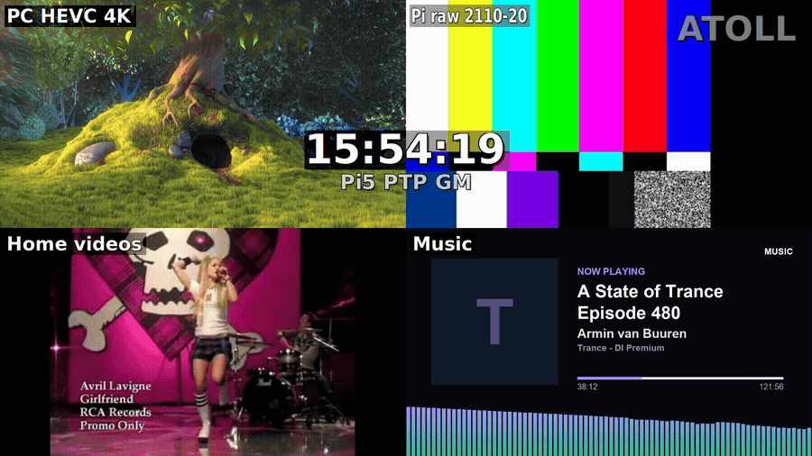
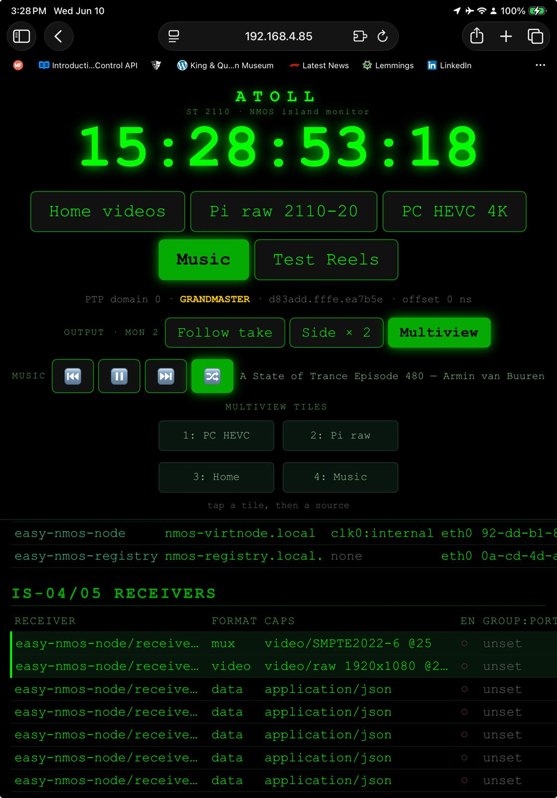

# Atoll

> **Running the rig?** See [STARTUP.md](STARTUP.md) for the bring-up / shutdown runbook.

**An iPad-controlled ST 2110 / NMOS broadcast-over-IP multiviewer, monitoring rig and standards
demonstrator.**

Atoll turns a PC with an NVIDIA GPU into a small broadcast-IP island: a layout-switchable
**multiviewer** on a dedicated monitor, an **IS-05 source switch + IS-04/05/07 inspector** you drive
from an iPad, real **PTP timecode** from a Raspberry Pi grandmaster, a **live flow analyser**, and
sixteen concurrent multicast flows covering most of the transports a real facility would carry —
uncompressed ST 2110-20, AES67 audio, ancillary timecode, JPEG XS, JPEG 2000, H.264, HEVC, VP9,
MJPEG, Opus, MPEG-TS, plus working **ST 2022-1 FEC** and **ST 2022-7 seamless** demonstrations.
Every source is discoverable over NMOS and carries **IS-07 tally**.

It started as a home lab for learning ST 2110 / NMOS end to end. Everything is config-driven, so with
the right hardware you can re-home it to your own network by editing two files.


*The `wall` layout on monitor 2. Every tile carries the bitrate and frame rate measured off the wire,
plus audio meters; the red flag on Live TV is real **NMOS IS-07 tally**, pushed from the emitter over
WebSocket rather than read out of the panel's own state.*

---

## What it does

- **2×2 multiviewer** on a second monitor — **any source in any tile**, reassigned live from the iPad
  ("pick a tile, then a source"). Also single-source "follow take" and side-by-side layouts.
- **The `wall` layout** — a Python multiview with **per-tile bitrate, frame rate, audio meters and
  live IS-07 tally**, plus FEC recovery counters on the FEC tile.
- **Single view with VU meters** — per-channel audio metering and a live stream-info overlay
  (codec, resolution, fps, bitrate), lip-synced to the video.
- **IS-05 switch panel** — tap a source to issue a real IS-05 take; the native output follows.
- **IS-04/05 inspector** — browse nodes / senders / receivers, their flows, caps, transport params and
  subscriptions, live from the registry Query API and the node Connection API.
- **NMOS IS-07 Event & Tally** — every source publishes an on-air boolean with TAI timestamps,
  registered in IS-04 and **pushed over WebSocket**; the wall and the analyser are both receivers.
- **Island flow analyser** (`:8101`) — per-flow **packet rate**, bitrate, average datagram size, RTP
  payload type / SSRC, packets actually lost, plus the IS-07 tally and event stream.
- **Live TV** — an HDHomeRun tuner re-encoded onto the island, with make-before-break channel changes (the next channel opens on a second tuner, then the cut),
  favourites and a remote on the panel.
- **ST 2022-1 FEC break-and-repair** — a loss injector you drive from the panel, with column/row FEC
  you can switch off to watch the picture fall apart and back.
- **ST 2022-7 seamless protection switching** — the same essence on two paths; kill either and the
  output is hitless.
- **PTP timecode** overlaid on the wall, relayed from the Pi grandmaster.
- **Audio that follows the selected source**, lip-synced where the source carries its own audio.

<p align="center">
  
</p>

*The assignable multiview in action — pick a tile, then a source, and it swaps into that quadrant live.*

---

## The flows

Sixteen multicast flows run concurrently on the island — eighteen if you count the two FEC parity
streams separately, as the analyser does. Everything below is live at once, and the analyser at
`:8101` shows all of it with real packet counts.

| Flow             | Transport                                   | Group : port         | Source / note                    |
|------------------|---------------------------------------------|----------------------|----------------------------------|
| Pi audio         | SMPTE **ST 2110-30** L24 / AES67 (RTP)      | `239.10.10.10:5004`  | Raspberry Pi 5                   |
| Pi raw video     | SMPTE **ST 2110-20** uncompressed (RFC 4175)| `239.10.10.21:5006`  | Raspberry Pi 5                   |
| Home videos      | HEVC over MPEG-TS                            | `239.10.10.22:5008`  | PC playlist                      |
| Music            | HEVC over MPEG-TS (NMOS source)             | `239.10.10.30:5012`  | Mac "Now Playing", bridged       |
| Music audio      | SMPTE **ST 2110-30** L24 / AES67 (RTP)      | `239.10.10.32:5013`  | Mac "Now Playing", bridged       |
| Test Reels       | HEVC over MPEG-TS                            | `239.10.10.31:5014`  | PC reels loop (NMOS-registered)  |
| Ancillary        | SMPTE **ST 2110-40** ATC timecode (RFC 8331)| `239.10.10.50:5020`  | PC, locked to PTP                |
| Live TV          | HEVC over MPEG-TS                            | `239.10.10.65:5010`  | HDHomeRun tuner, re-encoded      |
| JPEG 2000        | **J2K over RTP** (RFC 5371)                  | `239.10.10.70:5016`  | PC                               |
| H.264            | **H.264 over RTP** (RFC 6184)                | `239.10.10.75:5018`  | PC, GPU encode                   |
| Opus             | **Opus over RTP** (RFC 7587)                 | `239.10.10.80:5022`  | audio essence for the H.264 feed |
| MJPEG            | **Motion JPEG over RTP** (RFC 2435)          | `239.10.10.85:5024`  | PC, all-intra                    |
| VP9              | **VP9 over RTP** (RFC 7741)                  | `239.10.10.90:5026`  | PC, CPU encode / GPU decode      |
| TS over RTP      | **MPEG-TS over RTP** (SMPTE **ST 2022-2**)   | `239.10.10.95:5028`  | PC, pt 33, A/V programme         |
| FEC media        | **ST 2022-1** protected media                | `239.10.10.100:5040` | + column `:5042`, row `:5044`    |
| 2022-7 path A    | **ST 2022-7** seamless, path A               | `239.10.10.105:5046` | identical essence, two paths     |
| 2022-7 path B    | **ST 2022-7** seamless, path B               | `239.10.10.106:5048` | either can be killed, hitless    |

**JPEG XS** (ST 2110-22) also runs, as a local encode→decode rather than over the island: at
~100 Mbit/s CBR it exceeds what WSL's mirrored networking will carry (see *Platform notes*).

### Standards demonstrated

| Family              | Specifications                                                            |
|---------------------|---------------------------------------------------------------------------|
| SMPTE ST 2110       | **-20** uncompressed video · **-30** L24 audio · **-40** ancillary · **-22** JPEG XS |
| SMPTE ST 2022       | **-1** FEC (column + row) · **-2** TS over RTP · **-7** seamless protection switching |
| AMWA NMOS           | **IS-04** discovery & registration · **IS-05** connection management · **IS-07** event & tally |
| Timing              | **PTP** (IEEE 1588) grandmaster, **TAI** timestamps shared by essence and tally |

---

## Architecture

> **Want the detail?** [docs/ARCHITECTURE.md](docs/ARCHITECTURE.md) walks through every module —
> what each program does, which ports, groups and state files connect them, and sequence diagrams
> for a take, a channel change and a demo knob.

```
                iPad / browser  ─── http :8096 ────┐
                panel · inspector · TV remote      │
                                                   ▼
   ┌────────────────────────────────────────────────────────────────────────────┐
   │  PC + WSL2  ·  NVIDIA GPU (NVENC / NVDEC)                                   │
   │                                                                             │
   │  CONTROL    monitor-web.py   IS-05 panel + IS-04/05 inspector        :8096  │
   │             analyser.py      island flow analyser                    :8101  │
   │             is07-tally.py    IS-07 Event & Tally        :8102 · ws    :8103  │
   │             docker           NMOS registry :8080 · virtnode :8090           │
   │                                                                             │
   │  SENDERS    atoll-tv    Live TV (HDHomeRun → HEVC/TS, seamless retune)      │
   │             atoll-home · atoll-music · atoll-j2k · atoll-anc                │
   │             atoll-h264 + atoll-opus · atoll-mjpeg · atoll-vp9               │
   │             atoll-tsrtp · atoll-fec (2022-1) · atoll-sps (2022-7 A+B)       │
   │                                                                             │
   │  RENDERER   output-render.sh  →  wall-view.py   (2×2 + meters + tally)      │
   │                               →  meter-view.py  (single + VU + info)        │
   └──────────────┬──────────────────────────────────────────────┬──────────────┘
                  │  wired ST 2110 island                        │  glimagesink
                  │  (managed switch, IGMP snooping)             ▼
                  ▼                                     Monitor 2 — the wall
       Raspberry Pi 5  ·  PTP grandmaster               wall · multi · side · single
       ST 2110-20 raw · ST 2110-30 L24 audio
       PTP web clock :8000
                  ▲
                  │  "Now Playing" .ts over WiFi
             Mac (optional)
```

The PC and Pi sit on a dedicated wired **island** (e.g. `10.10.10.0/24`) carrying the multicast media;
the iPad and the optional Mac reach the PC over the regular management/WiFi network.

### The NMOS control plane

Tally is not a private variable passed between our own programs — it is published as a standard
event stream that anything on the network can consume, and consumed that way by our own renderers:

```
   panel /take  (IS-05)
        │
        ▼
   is07-tally.py ─── node · device · 13 sources · flows · senders ──▶  IS-04 registry :8080
    (the emitter)     re-registered on 404, health every 5s              (nmos-cpp)
        │
        │  IS-07 state messages — pushed the moment a source goes on or off air,
        │  stamped in TAI (the same epoch PTP distributes), never polled
        │  ws://<host>:8103/x-nmos/events/v1.0/devices/<device_id>
        │
        ├──────────────▶  wall-view.py   per-tile ON AIR flag + "NMOS IS-07" provenance
        └──────────────▶  analyser.py    TALLY column · subscription health · event log
```

Both receivers share one client (`pc/is07client.py`) and both fall back to polling the panel *only*
while the subscription is down, so normal operation costs no HTTP at all.

### The protection demos

ST 2022-1 and ST 2022-7 solve different halves of the same problem, and the rig shows both failing
and recovering on demand:

```
  ST 2022-1  — repair a lossy path            ST 2022-7 — survive a dead one

   media  :5040 ─┐                              path A :5046 ─┐
   column :5042 ─┼─▶ loss injector ─▶ fecdec     path B :5048 ─┴─▶ seamless merge
   row    :5044 ─┘   (panel slider)   rebuilds    identical essence, two paths
                                       the                    │
                                       missing                ▼
                                       packets        kill either path:
                                                      output never blinks
```

The FEC tile reports `dropped / recovered / residual / reordered` live, so "it recovered" is a
number on screen rather than a claim.

---

## Hardware you need

**Required**
- A PC with an **NVIDIA GPU** (NVENC/NVDEC — GeForce RTX class or better).
- A **managed Ethernet switch with IGMP snooping**, plus a wired NIC on the PC for the island.
- A browser device for control (the panel is tuned for an iPad, but any browser works).

**Operating system** — Windows 10/11 with **WSL2** (the reference setup), or a **Debian/Ubuntu**
Linux box (the scripts are Linux; the WSL-specific bits are noted below).

**Optional**
- A **Raspberry Pi 5** as the ST 2110 source + PTP grandmaster (`pi/`).
- A **Mac** running a "Now Playing" `.ts` server for the music channel.
- An **HDHomeRun** tuner for the Live TV channel.

---

## Quick start

```bash
git clone <this-repo> pi-nmos-st2110
cd pi-nmos-st2110

# 1. Install deps + bring up the NMOS stack (Debian/Ubuntu, WSL2 or native).
bash install.sh                 # or:  bash install.sh --check   (checks only, no changes)

# 2. Configure for your environment.
$EDITOR pc/atoll.conf           # user, island subnet, the multicast groups, media paths

# 3. Give the wired NIC the island IP (matches ISLAND_PC_IP), e.g.:
sudo ip addr add 10.10.10.2/24 dev eth0      # Linux
#   New-NetIPAddress -InterfaceAlias Ethernet -IPAddress 10.10.10.2 -PrefixLength 24   (Windows admin)

# 4. Start it — Linux-native, one shot (NMOS stack + panel + senders + multiview):
bash pc/atoll-up.sh
#   …or piecemeal:       bash pc/monitor-run.sh   then   bash pc/launch-media.sh
#   …or on Windows/WSL:  powershell -ExecutionPolicy Bypass -File pc/restore.ps1
```

Open the panel at `http://<this-host>:8096` (from the iPad, the PC's WiFi IP). On the Pi:
deploy `pi/` and run `sudo bash ~/launch-all.sh` (with `pi/atoll-pi.conf` alongside).

### Web endpoints

| Port   | What                                                              |
|--------|-------------------------------------------------------------------|
| `8096` | **Panel** — IS-05 switch, IS-04/05 inspector, TV remote, tile picker |
| `8101` | **Flow analyser** — per-flow pps/bitrate/loss + IS-07 tally & events |
| `8102` | **IS-07** Event & Tally REST API (`/x-nmos/events/v1.0/…`)          |
| `8103` | **IS-07 WebSocket** transport (per-device endpoint, push)           |
| `8080` | NMOS **registry** (IS-04 Registration + Query)                      |
| `8090` | NMOS **virtual node** (IS-05 Connection API)                        |
| `8098` | Standalone TV channel picker (also built into the panel)            |
| `8099` | Browser multiview · `8100` JPEG XS view · `5000` AMWA testing tool   |
| `8000` | PTP web clock — **on the Pi**                                       |

---

## Configuration

All environment-specific values live in **two files** — no IPs, groups, paths, or usernames are
hardcoded anywhere else:

- **`pc/atoll.conf`** — the PC/host config. Identity (`ATOLL_USER`), the island IP +
  auto-detected interface, every multicast group, media paths, service ports, the FEC matrix
  (`FEC_COLUMNS`/`FEC_ROWS`), wall tuning (`WALL_W`/`WALL_H`/`WALL_SYNC`/`WALL_SW_DECODE`) and the
  WSL GPU setting. Sourced by the bash scripts; read by Python via `pc/atoll_config.py` (which
  sources it in bash once and caches); read by `restore.ps1` (which parses it natively on Windows).
- **`pi/atoll-pi.conf`** — the Pi config. Its ST 2110-20/-30 groups **must match** `atoll.conf`'s
  `PI_*` values. Deploy it alongside `pi/launch-all.sh`.

Re-homing Atoll to your network is: edit those two files. See `pc/atoll.conf` for the full surface.

---

## Using the panel

<p align="center">
  
</p>

- **Sources** — tap any source to take it (the output follows, and so does the audio). Alongside the
  original channels there are buttons for H.264, MJPEG, VP9, TS-over-RTP, FEC and 2022-7.
- **Output · Mon 2** — **Follow take** (single fullscreen), **Side × 2**, **Multiview** (2×2), or
  **Wall +tally** (the instrumented 2×2 with meters, bitrate and IS-07 tally).
- **Multiview tiles** — tap a tile in the 2×2 grid, then tap a source to drop it into that quadrant.
- **Live TV** — channel remote with **favourites** (star to save, quick-tune row).
- **FEC** — loss injector slider plus column/row FEC on/off, for the break-and-repair demo.
- **2022-7** — kill either path independently and watch the output stay clean.
- **Music** — transport controls (⏮ ⏯ ⏭ 🔀) + live title/artist, proxied to the Mac's control API.
- **Inspector** — tap any IS-04/05 row to drill into its full JSON (flows, caps, transport, subs).

---

## Repository layout

```
install.sh            one-shot host bootstrap (deps, GPU/plugin checks, NMOS stack, guidance)
pc/
  atoll.conf          ← the PC config (edit this)
  atoll_config.py     Python reader for atoll.conf
  monitor-web.py      iPad panel: IS-05 switch + IS-04/05 inspector + TV remote (:8096)
  analyser.py         island flow analyser: pps, bitrate, RTP loss, IS-07 tally (:8101)
  is07-tally.py       NMOS IS-07 Event & Tally emitter + WebSocket transport (:8102/:8103)
  is07client.py       shared IS-07 WebSocket receiver (used by the wall and the analyser)
  output-render.sh    the monitor-2 renderer (wall / multi / side / single)
  wall-view.py        instrumented 2×2 wall: meters, bitrate, fps, IS-07 tally, FEC counters
  meter-view.py       single/fullscreen renderer: VU meters + live stream-info overlay
  tv-send-inputselect.py  Live TV sender (HDHomeRun → HEVC/TS, seamless channel changes)
  media-send.sh       HEVC playout sender (--hevc | --jxs | --reels)
  music-send.sh       bridges the Mac "Now Playing" feed onto the island
  h264-send.sh  opus-send.sh  mjpeg-send.sh  vp9-send.sh  tsrtp-send.sh   codec feeds
  fec-send.sh         ST 2022-1 protected feed (media + column + row FEC)
  sps-send.sh         ST 2022-7 dual-path seamless feed
  fecverify.py        proves FEC recovery is byte-exact against a reference branch
  reels-nmos.py       registers the Test Reels NMOS sender (+ serves its SDP)
  launch-media.sh     brings up all senders + the renderer
  restore.ps1         Windows/WSL one-shot boot
  grab-screen.ps1     capture the PC's actual monitors for diagnosis
  build-reels-loop.ps1  concatenate reels clips into one continuous loop
pi/
  atoll-pi.conf       ← the Pi config (edit this)
  launch-all.sh       Pi ST 2110-20/-30 generators + PTP grandmaster + web clock
  master-clock-web.py PTP web clock (:8000)
deploy/nmos/          the NMOS stack: docker-compose + registry.json + node.json
docs/
  ARCHITECTURE.md     module-by-module system diagram: what each program does and how they connect
  superpowers/        design notes / project state
```

---

## Platform notes

The reference rig runs on **Windows + WSL2** (mirrored networking, WSLg for the GPU display, the
`d3d12` Mesa driver). Atoll **auto-detects** WSL vs Linux-native (`ATOLL_PLATFORM`, set in
`atoll.conf` from `/proc/version`) and branches the GPU driver, audio server, display sink
(`VIDEO_SINK`), media paths, and window placement accordingly — so the same scripts run on both.

**The island's real ceiling on WSL is packet rate, not bandwidth.** Mirrored networking limits
multicast *receive* by packets per second, which is why uncompressed HD ST 2110-20 and JPEG XS
(~100 Mbit/s CBR) do not fit while sixteen compressed flows do, and why the Pi stays 320×240. The
analyser exists largely to make this visible: it was how the `mpegtsmux alignment=7` fix was found
(Live TV was burning 4,470 pps on 188-byte datagrams for 6.7 Mbit/s; bundling 7 TS packets per
datagram cut it to 653 pps). Average datagram sizes under ~400 B are highlighted there for exactly
this reason.

On a **Linux-native** box (on the island, with an NVIDIA GPU) none of the WSL machinery runs:
no `d3d12`/WSLg, no `/mnt/c`, no PowerShell window-mover. Bring the whole rig up with
**`bash pc/atoll-up.sh`** (the cross-platform sibling of `restore.ps1`). For an X11 session set
`VIDEO_SINK=ximagesink` in `atoll.conf` (and handle fullscreen via your window manager); on Wayland
the default `waylandsink fullscreen=true` works as-is. (The WSL build instead presents on-screen via **glimagesink** — waylandsink's WSLg SHM path, lacking dmabuf, *steps* fine scrolling content; with real dmabuf on a native GPU, waylandsink is smooth.) This is the natural turnkey-appliance target.

---

## Credits & licence

Built on excellent open infrastructure:
- **[nmos-cpp](https://github.com/sony/nmos-cpp)** / **[easy-nmos](https://github.com/rhastie/easy-nmos)** — the IS-04/05 registry + virtual node.
- **[AMWA NMOS Testing Tool](https://github.com/AMWA-TV/nmos-testing)** — conformance testing.
- **[GStreamer](https://gstreamer.freedesktop.org/)** + **[FFmpeg](https://ffmpeg.org/)** — the media pipeline.
- **Big Buck Bunny** (© Blender Foundation, CC-BY 3.0) — the HEVC demo clip.

Atoll is licensed under **Apache-2.0** — see [`LICENSE`](LICENSE) and [`NOTICE`](NOTICE). NMOS is an
[AMWA](https://www.amwa.tv/) family of specifications; SMPTE ST 2110 is a SMPTE standard.
