# Atoll — system architecture

A module-by-module walk through the code: what each program is, what it does, and how it
connects to the others. The diagrams are Mermaid, so GitHub renders them inline. For *operating*
the rig see [STARTUP.md](../STARTUP.md); for *what* it is see the [README](../README.md).

Every value quoted here (group, port, timer) is read from the code as of this writing. Where a
number lives in config it says so; the config files are `pc/atoll.conf` and `pi/atoll-pi.conf`.

---

## 1. The whole system on one page

Atoll is five layers. Everything in the code sits in exactly one of them.

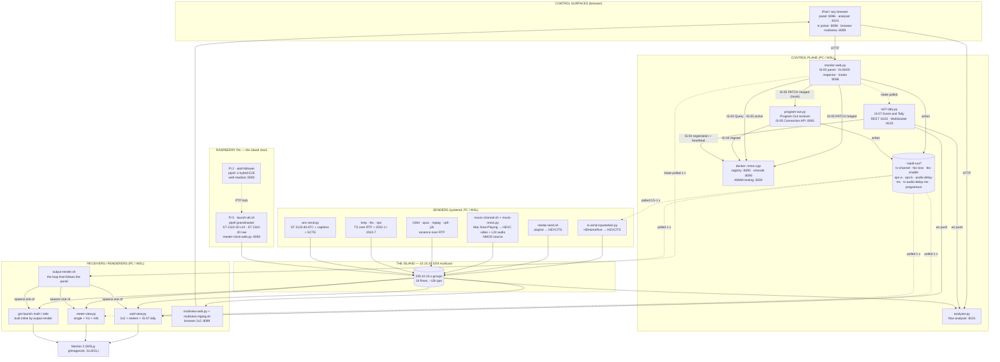

**How to read it.** Solid arrows carry media or make a request. Dotted arrows are *polls*: Atoll
deliberately couples its processes through the panel's `/state` endpoint and a handful of plain
text files, not through sockets between programs, so any one process can be restarted without the
others noticing. The two exceptions are IS-05 (the panel really does PATCH the NMOS node) and
IS-07 (tally really is pushed over WebSocket), because those are the standards the rig exists to
demonstrate.

---

## 2. Physical and network topology

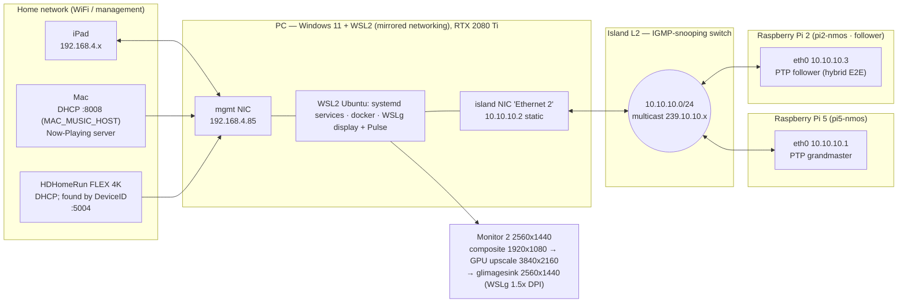

Two networks, one bridge. The PC is the only device on both: it *pulls* the Mac and HDHomeRun
streams over WiFi and *re-encodes* them onto the island. Nothing on the island is routable from
the home network, which is why `NMOS_ADVERTISE_HOST` in `atoll.conf` is the WiFi address, not the
island address (a controller on WiFi could never reach `10.10.10.2`).

The island's ceiling is **packet rate**, not bandwidth: WSL mirrored networking limits multicast
*receive* to roughly 12–15k packets/s across all groups. That single fact explains most of the
design choices below (720p everywhere, `mpegtsmux alignment=7` on every TS sender, the Pi staying
at 320x240). JPEG XS now also runs as a **true ST 2110-22 network flow** (RFC 9134 `video/jxsv`, see §6); the older local encode→decode viewer (`jxs-web.py`) stays as a codec proof.

---

## 3. Process inventory

Every long-running program, who starts it, and where it lives. Enabled systemd units start when
WSL boots (WSL itself does not start with Windows). `~/atoll-run` is `ATOLL_RUN` in `atoll.conf`.

### Control plane

| Process | File | Owner | Listens | Role |
|---|---|---|---|---|
| Panel | `pc/monitor-web.py` | `atoll-panel` | `:8096` | The iPad page -- grouped into labelled sections (Sources, Output, Production Switcher, Program Out, Multiview, Music, Resilience, Live TV, Demo), with the mode-specific sections shown only for the active OUTPUT mode -- and the single source of truth for *active source*, *layout* and *tile slots*. Issues IS-05 takes and routes Program Out over IS-05. Writes the knob files. Proxies the Mac music API and the Pi clock. A **Guided demo** button runs a scripted, captioned tour of the whole rig. |
| IS-07 emitter | `pc/is07-tally.py` | `atoll-is07` | `:8102` REST, `:8103` ws | One boolean event source per Atoll source key. Registers node/device/13 sources/flows/senders in IS-04. Pushes state on transition. |
| Program Out | `pc/program-out.py` | `atoll-programout` | `:8092` | Software NMOS receiver: serves the IS-05 v1.1 Connection API and registers its node/device/receiver in IS-04. On activation it maps the connection's multicast/port to an island flow and writes `~/atoll-run/programout` for the renderer. Publishes **BCP-004-01** receiver capabilities (`caps.constraint_sets`) so controllers know what it accepts. When `~/atoll-run/auth-enable` is set it also **enforces IS-10**: a `PATCH /staged` needs a valid bearer token (RS256 verified against the AS JWKS, with `x-nmos-connection` write access) or it is refused `401`. |
| Authorization server | `pc/auth-server.py` | `atoll-auth` | `:8106` | AMWA **IS-10** OAuth 2.0 / JWT authorization server (BCP-003-02). Issues RS256-signed bearer tokens via the `client_credentials` grant, each carrying the NMOS private claims (`x-nmos-<api>` access rights); publishes its public key as a **JWKS**, its **RFC 8414** metadata at `/.well-known/oauth-authorization-server`, an **RFC 7591** dynamic-registration endpoint, and advertises itself over DNS-SD (`_nmos-auth._tcp`). The RSA key persists in `~/atoll-run/auth-key.pem` so tokens survive restarts. |
| Music NMOS source | `pc/music-nmos.py` | `atoll-music-nmos` | `:8093` | Registers the music channel as an IS-04 node with two senders — video (HEVC) and ST 2110-30 L24 audio — and serves an SDP per sender, so music is discoverable in the inspector and routable via Program Out. Also serves the **sender-side IS-05 v1.1 Connection API** for both senders — a controller can re-point where each sender transmits (multicast destination) live; the pipeline moves and the SDP/registry update. Heartbeats like the other registrars. |
| Audio channel map (IS-08) | `pc/audiomap-nmos.py` | `atoll-audiomap` | `:8094` | Serves the AMWA IS-08 v1.0 Channel Mapping API for the music audio (node/device with a `cm-ctrl` control). A controller maps the output's channels to the input's (stereo / swap / mono / mute); on activation it writes `~/atoll-run/audiomap` and restarts the audio mapper. Immediate + scheduled activation. |
| Pi ST 2110 NMOS | `pc/pi-nmos.py` | `atoll-pi-nmos` | `:8095` | Registers the Pi's real ST 2110-20 raw video and -30 L24 audio as an IS-04 node (`atoll-pi`) with two senders, serving a standards-complete SDP each (ST 2110-20/-21 fmtp, `mediaclk`, `ts-refclk` with the grandmaster id). Makes the Pi flows discoverable + routable. |
| JPEG XS NMOS | `pc/jxs-nmos.py` | `atoll-jxs-nmos` | `:8097` | Registers the true ST 2110-22 JPEG XS sender (**BCP-006-01**) as an IS-04 node/flow/sender and serves its manifest. The SDP is the point: `a=rtpmap jxsv/90000` + the RFC 9134 `a=fmtp` (packetmode, transmode, profile/level/sublevel, sampling, depth, width, height, exactframerate, colorimetry, TCS), the `b=AS` bandwidth and `ts-refclk`/`mediaclk`; the Flow carries `media_type=video/jxsv` with components + profile/level/sublevel + bit_rate. Geometry shared with the sender via `atoll.conf` so the manifest can't drift from the wire. |
| Loudness meter | `pc/loudness.py` (+ `pc/bs1770.py`) | `atoll-loudness` | `:8104` | EBU R128 / ITU-R BS.1770-4 loudness on the **program** audio (follows the active source / Program Out). Momentary / Short-term / gated Integrated LUFS + Loudness Range (LRA) + true peak (dBTP), with an EBU R128 in-spec check (−23 LUFS ±1 LU, true peak ≤ −1 dBTP). numpy-only K-weighting (FIR of the BS.1770 biquads). Serves JSON + a broadcast readout; the analyser header shows it too. |
| Flow analyser | `pc/analyser.py` | `atoll-analyser` | `:8101` | Raw-socket join of every group: pps, bitrate, average datagram, RTP pt/SSRC/loss. IS-07 receiver (tally column + event log). |
| NMOS registry | `deploy/nmos/docker-compose.yml` → `nmos-registry` | docker | `:8080` HTTP, `:8081` ws, `:1883` MQTT | nmos-cpp IS-04 Registration + Query API, and the IS-09 System API (`/x-nmos/system/v1.0/global`) the Atoll nodes discover. |
| NMOS virtual node | `nmos-virtnode` | docker | `:8090` HTTP, `:8091` ws | nmos-cpp example node: the receivers `v0`/`m0` the panel switches, plus its own IS-07 sources. |
| AMWA testing tool | `nmos-testing` | docker | `:5000` | Conformance tester. IS-04/05/07 pass; **IS-09-01** (System API server) and **IS-09-02** (multicast discovery — test_01/03/04) now pass against Atoll's stack (see §8 for the results + method). |
| TV picker (standalone) | `pc/tv-web.py` | `atoll-tv-web` | `:8098` | Channel grid that writes `tv-channel`. Superseded by the panel's built-in remote; kept running. |

### Senders

| Source key | Service | File | Encode | Transport | Group : port |
|---|---|---|---|---|---|
| `hevc` "Live TV" | `atoll-tv` | `pc/tv-send-inputselect.py` | NVENC HEVC 6 Mb/s + AAC 5.1 384 kb/s | MPEG-TS / UDP | `239.10.10.65:5010` |
| `jxs` "Home videos" | `atoll-home` | `pc/media-send.sh --jxs ~/atoll-playlist` | NVENC HEVC 12 Mb/s + MP3 192 | MPEG-TS / UDP | `239.10.10.22:5008` |
| `music` | `atoll-music` | `pc/music-channel.sh` | NVENC HEVC 6 Mb/s, video-only (or a 4 Mb/s placeholder card) | MPEG-TS / UDP | `239.10.10.30:5012` |
| *(audio for `music`)* | `atoll-audiomapper` | `pc/music-channel.sh` → `pc/audiomapper.sh` | L24 48 kHz stereo, 1 ms ptime (pt 96); **IS-08 channel map** applied via `audiomixmatrix` | ST 2110-30 RTP | `239.10.10.32:5013` (pre-map localhost `5015`) |
| `reels` "Test Reels" | *(none — only `launch-media.sh`)* | `pc/media-send.sh --reels` | NVENC HEVC + MP3 | MPEG-TS / UDP | `239.10.10.31:5014` |
| `raw` "Pi raw 2110-20" | `atoll-pi` (on the Pi) | `pi/launch-all.sh` | none — UYVY 320x240 59.94 | ST 2110-20 RTP (RFC 4175) | `239.10.10.21:5006` |
| *(audio for `raw`)* | `atoll-pi` | `pi/launch-all.sh` | none — L24 48 kHz stereo, 1 ms ptime | ST 2110-30 RTP | `239.10.10.10:5004` |
| *(ancillary)* | `atoll-anc` | `pc/anc-send.py` | ATC timecode + CEA-708 captions + SCTE-104, multiplexed ST 291 packets | ST 2110-40 RTP (RFC 8331), pt 100 | `239.10.10.50:5020` |
| *(ancillary rx)* | `atoll-anc-recv` | `pc/anc-recv.py` | extracts timecode/captions/SCTE from the ANC flow; renders captions + AD-break on Program Out (gated by `cc-enable`) | receives `239.10.10.50:5020` | — |
| `j2k` | `atoll-j2k` | `pc/j2k-send.sh` | `avenc_jpeg2000` | J2K RTP (RFC 5371) | `239.10.10.70:5016` |
| `jxsv` | `atoll-jxs-rtp` | `pc/jxs-rtp-send.py` | `svtjpegxsenc` -> hand-built RFC 9134 payloader | **JPEG XS RTP (RFC 9134 `video/jxsv`), pt 112** | `239.10.10.61:5032` |
| *(jxsv rx)* | *(on demand)* | `pc/jxs-rtp-recv.py` | Python RFC 9134 depay -> `svtjpegxsdec` | receives `239.10.10.61:5032` | -- |
| `h264` | `atoll-h264` | `pc/h264-send.sh` | NVENC H.264 4 Mb/s | RTP (RFC 6184), pt 96 | `239.10.10.75:5018` |
| *(audio for `h264`)* | `atoll-opus` | `pc/opus-send.sh` | Opus 96 kb/s | RTP (RFC 7587), pt 97 | `239.10.10.80:5022` |
| `mjpeg` | `atoll-mjpeg` | `pc/mjpeg-send.sh` | `jpegenc quality=60` | RTP (RFC 2435) | `239.10.10.85:5024` |
| `vp9` | `atoll-vp9` | `pc/vp9-send.sh` | `vp9enc` CPU realtime | RTP (RFC 7741) | `239.10.10.90:5026` |
| `tsrtp` | `atoll-tsrtp` | `pc/tsrtp-send.sh` | x264 CPU + AAC | MPEG-TS over RTP (ST 2022-2), pt 33 | `239.10.10.95:5028` |
| `fec` | `atoll-fec` | `pc/fec-send.sh` | x264 all-intra + AAC | TS/RTP + ST 2022-1 column/row FEC | `239.10.10.100:5040 / 5042 / 5044` |
| `sps` | `atoll-sps` | `pc/sps-send.sh` | x264 + AAC, one encoder | TS/RTP duplicated after payloader (ST 2022-7) | A `239.10.10.105:5046`, B `239.10.10.106:5048` |
| `jpegxs` | `atoll-jxs-web` (viewer only) | `pc/jxs-web.py` | SVT JPEG XS local enc→dec | none — MJPEG to browser `:8100` | *(codec proof; the real 2110-22 flow is `jxsv` above)* |

Disabled on purpose, still in the repo: `atoll-hevc` (Big Buck Bunny clip on 5010, replaced by
Live TV), `atoll-jxs` (JPEG XS over TS at ~100 Mb/s, exceeds the WSL ceiling), `atoll-music-ph`
(placeholder card, now owned by `music-channel.sh`).

### Renderers

| Process | File | Owner | Output | Role |
|---|---|---|---|---|
| Renderer loop | `pc/output-render.sh` | **manual, local WSL terminal** | spawns the three below | Polls the panel once a second, builds a pipeline key from layout+source+slots, relaunches a child renderer only when the key changes. Also runs the audio follower. |
| Wall | `pc/wall-view.py` | child of output-render | WSLg window, monitor 2 | The instrumented 2x2: cairo overlay with tally border, per-tile bitrate/fps/audio meters, FEC counters. IS-07 receiver. Presents via **glimagesink** (GL/EGL, vsync-paced), GPU-upscaled to fill monitor 2. |
| Single view | `pc/meter-view.py` | child of output-render | WSLg window | Fullscreen active source with VU meters and a stream-info panel; hosts the live FEC/2022-7 knobs. **Seamless**: a persistent display pipeline (`intervideosrc` -> overlay -> **glimagesink** GL/EGL) reads one intervideo bus; a separate source pipeline (decode -> `intervideosink`, + audio -> level -> autoaudiosink) is rebuilt on a source change, so the window never respawns. meter-view polls the panel active source itself. |
| Side-by-side | `pc/side-view.py` | child of output-render | WSLg window, monitor 2 | **Seamless source-selectable 2-up** (panel slots 0/1 = left/right). Persistent display + two per-pane source pipelines over intervideo, so changing a pane rebuilds only that pane. Per-pane label/meters/bitrate/tally, shared CUDA context, **glimagesink** GL. Audio follows the LEFT pane (slot 0), marked with a ♪ AUDIO badge. |
| gst-launch multi | inline string in `output-render.sh` | child of output-render | WSLg window | The original 2x2, four `tile_full()` fragments, kept for comparison with the wall. Presents via **glimagesink** (GL/EGL), GPU-upscaled to fill monitor 2. |
| Browser multiview | `pc/multiview-web.py` + `pc/multiview-mjpeg.sh` | `atoll-multiview` | MJPEG `:8099` | Same compositor topology, JPEG frames over HTTP instead of a window. Built when WSLg could not show a window. |
| JPEG XS viewer | `pc/jxs-web.py` | `atoll-jxs-web` | MJPEG `:8100` | Local svtjpegxsenc→svtjpegxsdec, proof that the ST 2110-22 codec works here. |

### Pi

| Process | File | Owner | Role |
|---|---|---|---|
| `ptp4l -i eth0 -S` | `pi/launch-all.sh` | `atoll-pi` | PTP grandmaster for the island. |
| gst L24 sender | `pi/launch-all.sh` | `atoll-pi` | 440 Hz sine → `rtpL24pay` 1 ms ptime → `239.10.10.10:5004`. |
| gst raw sender | `pi/launch-all.sh` | `atoll-pi` | `videotestsrc` UYVY 320x240 59.94 → `rtpvrawpay` → `239.10.10.21:5006`. |
| Web clock | `pi/master-clock-web.py` | `atoll-pi` | `:8000` page + `/time` JSON, PTP status via `pmc`. The panel proxies `/time` for its timecode. |
| `ptp4l -s` follower (hybrid E2E) | `pi/follower-ptp.cfg` · `atoll-follower.service` | `atoll-pi` (Pi 2 · `10.10.10.3`) | 2nd-Pi **PTP follower** — locks its clock to the grandmaster. Hybrid E2E (unicast `Delay_Req`); software timestamping; NTP off so PTP owns the clock. |
| Follower web readout | `pi/follower-clock-web.py` · `atoll-follower-web.service` | `atoll-pi` (Pi 2) | `:8000` — live offset-from-master, servo state (`LISTENING`→`UNCALIBRATED`→`SLAVE`), GM identity, convergence sparkline. |

**PTP follower demo (2nd Pi).** A second Pi (a Pi 2B here — any Pi works) joins the island at
`10.10.10.3` and locks its clock to the Pi 5 grandmaster, demonstrating PTP between two nodes. The
one wrinkle: the island switch does **IGMP snooping with no querier**, so the grandmaster's *receive*
membership ages out and it silently ignores multicast `Delay_Req` — the follower reaches
`UNCALIBRATED` with `rx_Delay_Resp = 0` and never measures path delay. **Hybrid E2E** (unicast
`Delay_Req` straight to the master) sidesteps this with no grandmaster change. The Pi 2B has no PTP
hardware clock and a USB-attached NIC, so software-timestamping convergence sits around **±1–3 ms**
(a Pi 4's native NIC would be far tighter; a Pi 5's PHC tighter still). Both `atoll-follower*`
services are enabled for boot and the static IP persists via netplan, so the follower is fully
**autonomous** — verified re-locking unattended across both its own and the grandmaster's reboots.
`pi/launch-all.sh` now waits for NTP sync before starting `ptp4l`, so the grandmaster never anchors
to a stale boot-time clock and serves the wrong time to the rig.

**`slaveOnly` is production-realistic, not a demo shortcut.** The follower runs `slaveOnly 1`
because that is exactly how a real ST 2110 *endpoint* is configured — cameras, encoders, receivers
and multiviewers all run slave-only. They consume the reference time to stamp and align media; they
must never win BMCA and become the facility clock (a cheap endpoint oscillator feeding the whole
plant is the failure you design out — the safe failure is "no master → holdover → alarm", never
"an endpoint quietly becomes the reference"). Only the dedicated, good grandmasters are
master-capable and contend in BMCA. What *is* demo-specific here is the per-Pi web readout that
makes the offset visible: production endpoints lock silently, and PTP lock health is monitored
**centrally** (management/monitoring TLVs, the grandmaster's own dashboards, SNMP, an NMOS timing
monitor), not via a web page on each box. The panel's one-line follower status is closer to how
you'd really surface it — one pane watching grandmaster + endpoint health at a glance.

---

## 4. Configuration: one file, three readers

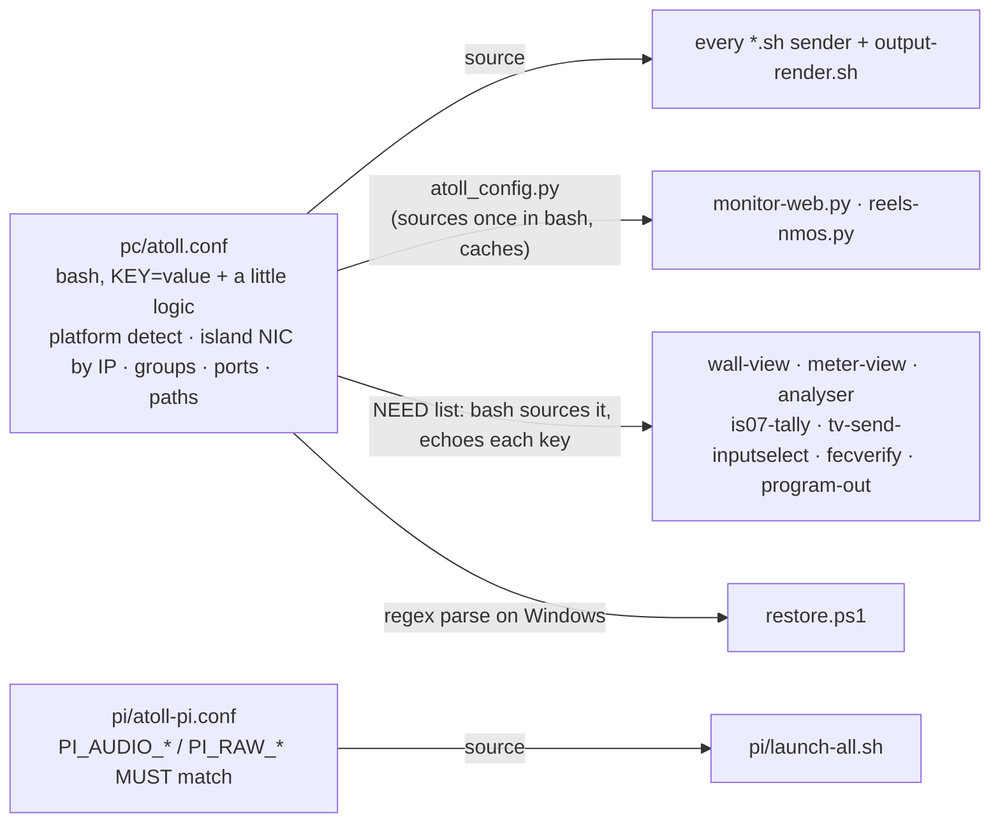

`atoll.conf` is the only place a group, port, IP, username or path is written. Three details in
it shape everything else:

- **Platform branch.** `ATOLL_PLATFORM` is set from `/proc/version`. On WSL it exports
  `GALLIUM_DRIVER=d3d12`, `PULSE_SERVER`, `XDG_RUNTIME_DIR=/mnt/wslg/runtime-dir` and
  `WAYLAND_DISPLAY` so GStreamer sinks find WSLg even under systemd (whose default runtime dir is
  wrong for WSLg).
- **Island NIC by IP.** WSL renames `eth0`/`eth1` across boots, so `ISLAND_IFACE` is resolved by
  finding whichever interface holds `ISLAND_PC_IP`. `pc/island_iface.py` does the same for the two
  legacy Python tools that predate the config file.
- **Python does not re-parse shell.** The Python programs shell out once, `source` the file, and
  echo the keys they need. That is why a new config key has to be added to a program's `NEED`
  list (or `atoll_config._VARS`) before it can read it.
- **The HDHomeRun is found by DeviceID, not IP.** It is on DHCP and its address drifts (a reboot
  moved it `192.168.7.88` → `192.168.4.32`, 4 Sep 2026). `pc/hdhr.py` resolves `HDHR_DEVICE_ID`
  to the current IP over the HDHomeRun UDP discovery broadcast; the sender and the panel call it at
  startup and re-call it when a tune or lineup fetch fails, so a DHCP move self-heals. `HDHR_HOST`
  is only the fallback used when discovery gets no answer.

---

## 5. The control plane in detail

### 5.1 `monitor-web.py` — the panel

One Python process, one thread per request, no framework. It holds three pieces of in-memory
state and exposes them as JSON:

| State | Set by | Read by |
|---|---|---|
| `_active["src"]` | `GET /take?src=` | `GET /state` → `output-render.sh`, `is07-tally.py` |
| `_output["layout"]` (`single`/`side`/`multi`/`wall`/`program`) | `GET /layout?mode=` | `GET /state` |
| `_slots[4]` (source key per quadrant) | `GET /slot?pos=&src=` | `GET /state` |

`take(src)` is the IS-05 part. `SOURCES` maps two keys to real NMOS receivers on the virtual node
(`raw` → `easy-nmos-node/receiver/v0`, `jxs` → `receiver/m0`); every other key has `label: None`.
A take resolves each labelled receiver by label (so node restarts that regenerate UUIDs do not
matter), then PATCHes `/x-nmos/connection/v1.1/single/receivers/<id>/staged` with
`master_enable` true for the taken one and false for the rest, `activate_immediate`. Taking a
non-NMOS source simply disables both. `active_src()` trusts the last take for 2 s
(`_ACTIVE_TTL`), then re-derives it from the receivers' `/active` state, so an external IS-05
controller changing `v0`/`m0` shows up on the panel too.

The rest of the routes are thin:

- `/nmos` builds the inspector view: IS-04 Query API (`:8080`) for nodes/devices/senders/
  receivers/flows, joined with each sender's and receiver's IS-05 `/active` from the node
  (`:8090`), cached 3 s. `/resource?kind=&id=` returns one object in full, plus IS-05
  active/staged/constraints and, for senders, the SDP fetched via `localhost:8090` because the
  node's own `manifest_href` points at a docker-internal address the iPad cannot reach.
- `/time` proxies the Pi's `:8000/time`; falls back to local time so the clock never blanks.
- `/music/state|next|prev|playpause|shuffle` proxy the Mac's Now-Playing API so the iPad needs
  one origin and no CORS.
- `/tv/lineup`, `/tv/set`, `/tv/fav` read the HDHomeRun `lineup.json` and write the
  `tv-channel` / `tv-favorites` files.
- `/fec/state`, `/fec/set`, `/sps/state`, `/sps/set` read and write the four demo knob files.

The page itself (the `PAGE_TEMPLATE` string) polls `/state` every 5 s, `/nmos` every 6 s, music
and the FEC/2022-7 knobs every 4 s, and `/time` every 3 s. It is a triple-quoted Python string, so
a `\'` inside its JavaScript collapses to `'` and breaks the whole script; use `data-*`
attributes and JS-assigned handlers when adding controls.

Program Out is the real receiver-side connection. `program-out.py` is a software NMOS receiver
(node + device + receiver, registered in IS-04, heartbeat every 5 s) that serves the IS-05 v1.1
Connection API on `:8092`. The panel's Program Out row PATCHes its `/staged` with the chosen
flow's `transport_params` (multicast IP + port) and `activate_immediate`; on activation the
receiver looks the (address, port) up in its catalogue of island flows and writes
`essence addr port sender_id` to `~/atoll-run/programout`. The `program` output layout follows
that knob, so an IS-05 connection actually drives the picture — unlike the `v0`/`m0` gate, and
discoverable, so any NMOS controller can route it too.

**Both halves of connection management.** Program Out is the *receiver* half; the music node
(`music-nmos.py`) is the *sender* half. It serves the IS-05 v1.1 Connection API for its two
senders (video + L24 audio) at `:8093/x-nmos/connection/v1.1/single/senders/`, and advertises
the `urn:x-nmos:control:sr-ctrl/v1.1` control on its device so any controller finds it. A PATCH
to a sender's `/staged` changes its `transport_params` — the multicast `destination_ip` and
`destination_port` — and `activate_immediate` (or the scheduled modes) applies it: the process
writes the new destination to a pipeline knob (`music-video-transport` for the video udpsink,
`music-audio-transport` for the audiomapper's L24 udpsink), restarts that one service, and
re-registers the sender so the SDP (`transportfile`) and the registry show the new destination.
The flow genuinely moves on the wire — a re-point of the audio sender to a test group put 3001
packets/3 s on the new group and 0 on the old, then reverted cleanly. Default (no knob) = the
configured groups, so a cold boot matches the SDP.

**Receiver capabilities (BCP-004-01).** The Program Out receiver publishes `caps.constraint_sets`
alongside the legacy `caps.media_types`: one constraint set enumerating the video media types it
accepts (`urn:x-nmos:cap:format:media_type`) plus the frame rates it handles, with a
`meta:label`/`meta:preference`. A controller reads these to decide which senders are compatible
*before* it routes one — the standards-clean way to answer "can this receiver take that sender?".

**Recent panel additions** (in the always-visible Output / Ancillary area): an **A/V sync** slider
writes `video-delay-ms` (a live `ts-offset` on every renderer's video sink; default 30 ms, holding
video back to meet WSLg's late audio); an **Ancillary - ST 2110-40** row toggles closed captions
(`cc-enable`, rendered by `anc-recv.py`), fires an SCTE-104 AD break, and shows the received ATC
timecode; and a **Record & Playback** section records a source's live multicast to a timestamped
`.ts` in `~/atoll-recordings` (lossless `udpsrc -> filesink`) and replays any clip -- PCR-paced by
`playback-send.py` -- to the Test Reels group, so you cut to a recording like any other input.

An **IS-10 Authorization** section toggles token enforcement on Program Out (`auth-enable`), shows the authorization server's live status (issuer + signing-key `kid`), and a **Test token enforcement** button stages one no-op `PATCH /staged` without a token and one with a freshly minted token, printing the two HTTP results side by side (`401` then `200`). While enforcement is on, the panel transparently fetches and caches a token from the AS and attaches it to its own Program Out routes, so takes keep working.

### 5.2 The knob files in `~/atoll-run`

These are the rig's "GPIO": the panel writes them, long-running pipelines poll them and apply the
value to a live element property, so nothing rebuilds.

| File | Written by | Read by | Effect |
|---|---|---|---|
| `tv-channel` | panel `/tv/set`, `tv-web.py`, the TV sender itself on error | `tv-send-inputselect.py` (0.5 s), `wall-view`/`meter-view` (label) | Retune Live TV. |
| `tv-favorites` | panel `/tv/fav` | panel | Favourite channel list. |
| `programout` | `program-out.py` on IS-05 activation | `output-render.sh` (`program` layout) | The flow routed to Program Out: essence + multicast + port. |
| `music-audio-transport` | `music-nmos.py` on IS-05 sender activation | `audiomapper.sh` (per restart) | Music L24 sender's multicast `host port`; absent = default `MUSIC_AUDIO_GRP`. Re-points the audio sender live. |
| `music-video-transport` | `music-nmos.py` on IS-05 sender activation | `music-channel.sh` (each loop) | Music video sender's multicast `host port`; absent = default `MUSIC_GRP`. Re-points the video sender live. |
| `video-delay-ms` | panel A/V sync slider (`/avsync/set`) | all renderers (1 s) | `ts-offset` on the video sink; +ms holds video back to match late audio (default 30). |
| `cc-enable` | panel CC toggle (`/cc/set`) | `anc-recv.py` | Gate for rendering ST 2110-40 captions / AD-break on Program Out. |
| `auth-enable` | panel IS-10 toggle (`/auth/set`) | `program-out.py`, panel | `1` = Program Out enforces IS-10 bearer tokens on `PATCH /staged`; the panel then attaches a token to its own routes. Default `0` (open). |
| `fec-loss` | panel `/fec/set` | `meter-view`, `wall-view` (1 s) | `identity drop-probability` on the FEC media flow: the loss injector. |
| `fec-enable` | panel `/fec/set` | `meter-view`, `wall-view` | Gates the column/row FEC flows (drop-probability 0 or 1) so protected vs unprotected is a live A/B at constant loss. |
| `sps-a`, `sps-b` | panel `/sps/set` | `meter-view`, `wall-view` | "Pull the cable" on a 2022-7 path. |
| `audio-delay-ms` | hand-edited | `output-render.sh` (1 s) | Trim on the standalone audio follower (side/multi/wall). |
| `tv-audio-delay-ms` | hand-edited | `meter-view.py` (1 s) | Pad offset on single view's audio queue; positive delays audio. |

### 5.3 A take, end to end

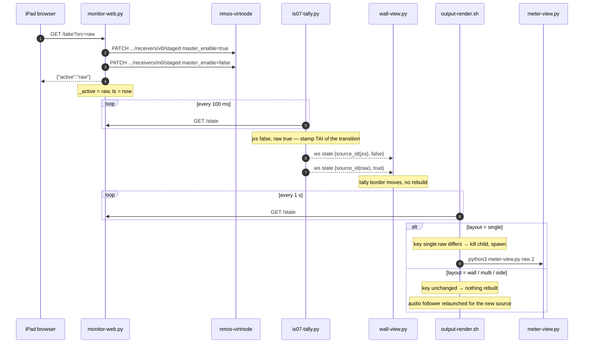

Two independent consumers, two latencies. Tally lights within about one poll of the emitter (the
push itself is instant). The renderer takes up to a second to notice, and only rebuilds when the
*visible* pipeline must change: a take in `wall` or `multi` moves the red border but leaves the
video untouched.

### 5.4 A Live TV channel change

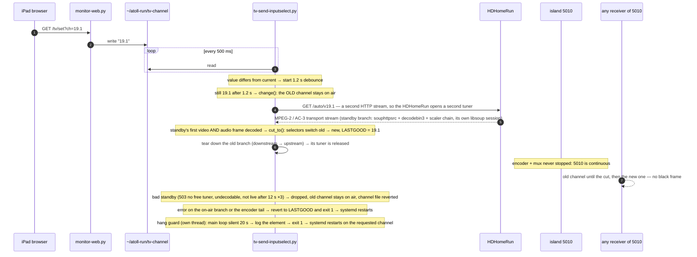

The whole point of `tv-send-inputselect.py` is that the encoder tail never stops. Channel changes
are make-before-break: the sender keeps an *on-air* branch and, during a change, a *standby* branch
(each `souphttpsrc → decodebin3 → scaler chain → selector request pad`), so two of the HDHomeRun's
four tuners are busy for the second or two the change takes. Three things make the cut clean rather
than a hole on 5010: the standby is cut in only once it has decoded both a video and an audio frame
(the mux stalls the whole output if it is switched to a pad that has not produced yet); each source
gets its own libsoup session (a `gst.soup.session` context per branch — otherwise both channels
share one I/O thread and the new one is starved until the old is released); and the pipeline
latency is pinned (~2.5 s) with the mux and sink queues sized above it, so the clock-synced udpsink
is never throttling a live source. The cost is ~1.7 s more end-to-end Live TV delay than the old
build, which nothing on the island depends on; a sub-second residual gap at the instant of the cut
is absorbed by the receivers' jitter buffers. The black / silence fallback on `sink_0` is only ever
on air at start-up or if the on-air branch itself dies. Its pipeline is built once:

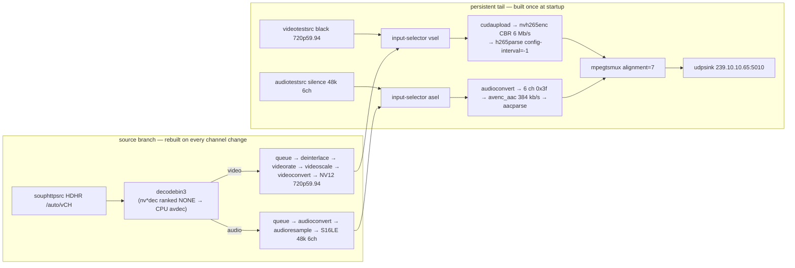

Three details that are not obvious from the diagram:

- **PTS restamp probes** on the selector source pads rewrite every buffer's PTS (and DTS) onto
  pipeline running-time with one shared offset for video and audio. Broadcast PCR time is
  ~10^5 s while `nvh265enc` stamps DTS from running-time; the resulting DTS-after-PTS in the
  33-bit TS clock made hardware decoders drop frames. Fixing it *before* the encoder is the only
  place it sticks.
- **Decode on CPU, encode on GPU.** `GST_PLUGIN_FEATURE_RANK` demotes every `nv*dec` before
  `Gst.init` so a channel change never leaks an NVDEC session that the receiving tiles need.
- **Always 6-channel AAC.** A changing channel count is a discontinuity; stereo channels are
  upmixed into the 5.1 layout so the audio stream shape never changes mid-stream.

### 5.5 A demo knob

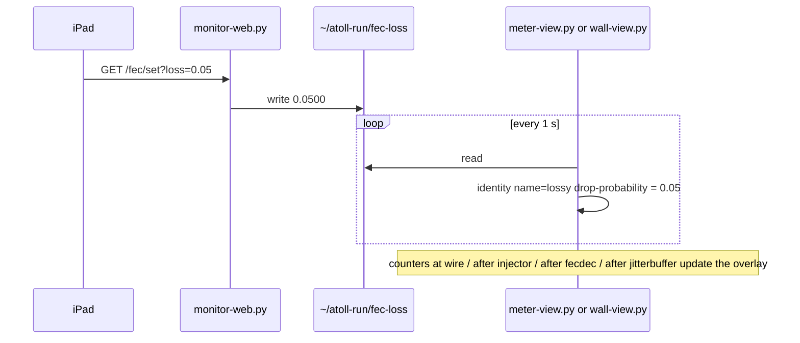

The same mechanism drives `fec-enable` (gates the two parity flows), `sps-a`/`sps-b` (gates a
2022-7 path) and the two audio trims. Because the change is a property write on a running element
the picture never blinks, which is what makes the "watch it fall apart and recover" demo work.

### 5.6 IS-10 authorization

`auth-server.py` (`atoll-auth`, `:8106`) is the rig's AMWA **IS-10** authorization server. It generates (and persists) a 2048-bit RSA key, then serves the OAuth 2.0 surface an NMOS control plane expects: **RFC 8414** metadata at `/.well-known/oauth-authorization-server`, a **JWKS** at `/jwks`, a `client_credentials` token endpoint at `/token`, and a simplified **RFC 7591** `/register`. It advertises `_nmos-auth._tcp` over DNS-SD so nodes can discover it. Each token is an RS256 JWT whose claims include the **BCP-003-02** private claims -- one `x-nmos-<api>` object per granted scope (`connection`, `node`, `query`, ...) carrying `read`/`write` access rights -- with a 1-hour expiry and a `kid` header naming the signing key.

The natural resource server to protect is **Program Out** (`program-out.py`), the rig's IS-05 receiver. When `~/atoll-run/auth-enable` is `1`, its `PATCH /staged` first validates the `Authorization: Bearer` token: it fetches the AS's public key by `kid` (PyJWT's `PyJWKClient` against `/jwks`), verifies the RS256 signature and expiry, and checks the token grants `x-nmos-connection` write access. Missing or invalid -> `401` with a `WWW-Authenticate: Bearer` header; valid -> the route proceeds as normal. The knob is the enforcement switch, so the demo is a clean A/B: flip it on, try a take without a token (the panel's *Test token enforcement* button shows the `401`), then a take with one (`200`). Token issuance is intentionally demo-open (any `client_id`) -- what the rig demonstrates is the token *lifecycle* and *resource-server validation*, not hardening the AS itself.

---

## 6. The senders

All senders are the same shape: a source, a conform to 720p30, an encoder, a packager, a
`udpsink` onto one multicast group with `ttl=1`, wrapped in `while true` so a crash restarts the
pipeline. They differ in the packager, and that is what puts them in three families.

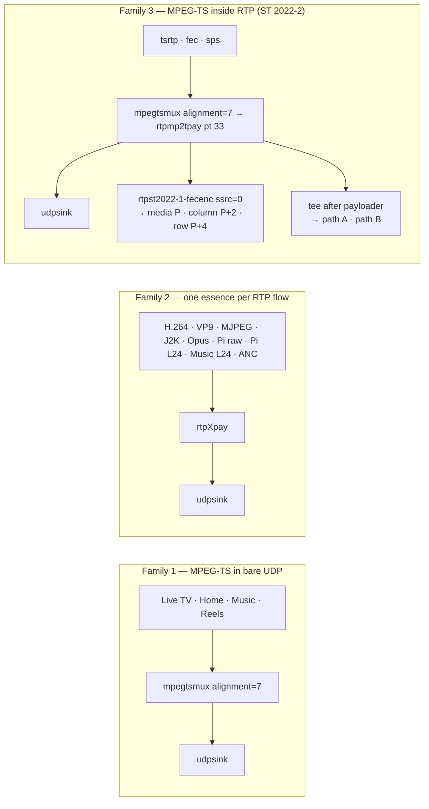

**Family 1** is the original rig. Bare TS has no sequence numbers, so a receiver cannot tell
loss from lateness, but it is what every decoder understands. Every one of these sets
`alignment=7` (seven 188-byte TS packets per datagram); the analyser highlights any flow whose
average datagram is under 400 B because that is the signature of forgetting it, and it cost
~4,650 pps island-wide before it was found.

**Family 2** is what ST 2110 does: separate flows per essence. The H.264 and Opus feeds are a
pair (bars and tone), and the receivers join both groups in one pipeline. `config-interval=-1`
on both `h264parse` and `rtph264pay` repeats SPS/PPS with every IDR so a late joiner can decode.
`anc-send.py` is hand-built because GStreamer has no ancillary payloader: it emits one RFC 8331
packet per frame **multiplexing several ST 291 data packets** (ANC_Count>1) -- ATC LTC timecode
(DID 0x60/0x60), CEA-708 closed captions (DID 0x61/0x01; the UDW carry caption text, a documented
simplified stand-in for full cc_data), and an on-demand SCTE-104 splice/ad-break (DID 0x41/0x07) --
each with ST 291 parity words + checksum, marker bit set, 90 kHz clock. `anc-recv.py`
(`atoll-anc-recv`) is the matching hand-built depayloader: it reverses the 10-bit packing, writes the
received timecode to `~/atoll-run/anc-tc`, and renders captions (and `AD BREAK` on an SCTE splice)
onto Program Out via the caption-band knob -- gated by `~/atoll-run/cc-enable`, which the panel's
**Ancillary - ST 2110-40** row toggles (with a Trigger-AD-break button and a live timecode readout).
This makes ST 2110-40 a full round-trip essence on the rig (send, discover, receive, render), not just
a flow on the wire.

**Real broadcast captions.** By default the caption text is synthetic (a rolling sample set), but
`cc-relay.py` (`atoll-cc-relay`) can relay the ACTUAL Live-TV captions. The island Live-TV feed is
re-encoded (`decodebin3 -> nvh265enc`), which strips the broadcast's CEA-608, so cc-relay taps the
HDHomeRun tuner directly for the current channel, extracts captions with **CCExtractor** (built
from source; GPAC too, since Ubuntu 25 drops it -- see STARTUP), and writes the current line to
`~/atoll-run/cc-input`, which `anc-send` carries and `anc-recv` renders. It follows `tv-channel`
and is gated by `cc-source` (`live`/`synthetic`), toggled from the panel's Ancillary row. CCExtractor's
live `--stream` mode is broken in this build, so it chunks (short tuner captures, overlapping capture
with playback) -- real captions with ~a chunk of latency. Not every channel is captioned (8.1/24.1 are).

**Family 3** is the demonstrator layer. Wrapping the TS in RTP is what makes ST 2022-1 FEC and
ST 2022-7 possible:

- `fec-send.sh` feeds the payloaded stream through `rtpst2022-1-fecenc` with a
  `FEC_COLUMNS x FEC_ROWS` matrix (5x5 from config, 40 % overhead) and sends three flows. The
  encoder requires `ssrc=0` on `rtpmp2tpay`. The video is all-intra (`key-int-max=1`) so the
  packet rate is high enough that a recovered packet, which can trail the live edge by a whole
  matrix, still lands inside the receiver's jitterbuffer window.
- `sps-send.sh` runs **one** encoder and `tee`s **after** `rtpmp2tpay ssrc=2022`, so both paths
  are bit-identical at the RTP layer. Two encoders would produce two streams no receiver could
  merge. The two paths are two groups on one L2, so fault isolation is simulated from the panel.

**The Live TV, Home and Music senders** need a word each. `media-send.sh` is a playlist: given a
directory it globs every video file, decodes with `decodebin3`, letterboxes to 720p30 NV12 and
loops forever; `atoll-home` points it at `~/atoll-playlist`, a folder of symlinks that
`launch-media.sh` builds from `MUSIC_ROOT`. `music-channel.sh` probes the Mac's `/state` every
cycle and runs either the live bridge (pull `nowplaying.ts` over WiFi, NVDEC → NVENC HEVC
video-only on 5012, plus AAC → ST 2110-30 **L24** (`rtpL24pay`, 1 ms ptime) on 5013) or a
"connecting" card for 15 s, so 5012 is never empty; an empty tile stalls the compositor.
`music-nmos.py` (`atoll-music-nmos`, `:8093`) then registers the channel as an NMOS source —
two senders (video + L24 audio) with an SDP each — so it is discoverable in the inspector and
routable via Program Out. `tv-send-inputselect.py` is section 5.4. The Mac Now-Playing host is reached at `MAC_MUSIC_HOST:8008` (`pc/atoll.conf`), a **hardcoded IP that drifts** with DHCP (it moved 192.168.6.159 → 192.168.4.51 mid-run, the same drift that moves the HDHomeRun); `.local`/mDNS does not resolve from WSL, so a **DHCP reservation** for the Mac mini (and the HDHomeRun) on the router is the durable fix — otherwise, when the Music tile shows "connecting", update `MAC_MUSIC_HOST` and restart `atoll-music`.

---

### 6.x  JPEG XS as true ST 2110-22 (RFC 9134 / BCP-006-01)

The rig carries JPEG XS two ways. The convenient way muxes the SVT-JPEG-XS codestream into MPEG-TS (`jxs-send.sh`) -- easy, but not ST 2110-22. The conformant way (`jxs-rtp-send.py`, `atoll-jxs-rtp`) carries the codestream **directly in RTP** with the RFC 9134 payload format, so it is a real `video/jxsv` essence. As with the ancillary sender, GStreamer has the codec (`svtjpegxsenc`, `image/x-jxsc`) but no RFC 9134 payloader, so it is hand-built: an `appsink` hands each whole codestream to Python, which fragments it in **codestream packetization mode** (K=0) into RTP packets carrying the 32-bit payload header (T sequential, K codestream, L last-of-frame, I progressive, F frame counter, P packet counter), marker bit on the frame's last packet, 90 kHz timestamp shared across the frame. `jxs-rtp-recv.py` is the matching hand-built depayloader (reassemble on the marker -> `svtjpegxsdec`), which proves the stream is standards-decodable end to end (verified: 1280x720 4:2:2 frames, JPEG XS SOC `0xff10` intact).

`jxs-nmos.py` (`atoll-jxs-nmos`) advertises it in IS-04 with a BCP-006-01-clean manifest -- the Flow is `media_type=video/jxsv` with components, profile/level/sublevel and bit_rate; the SDP has `jxsv/90000`, the full RFC 9134 `fmtp`, the `b=AS` bandwidth and the PTP `ts-refclk`. Geometry and the codestream descriptors (profile Main422.10, level 2k-1, sublevel Sublev3bpp, 4:2:2 8-bit) live in `atoll.conf`, read by both sender and registrar so the manifest can never contradict the wire. Runs 1280x720 at 30 fps (~57 Mb/s), one CPU core on the 20-core box; `JXS_FPS`/`JXS_W`/`JXS_H`/`JXS_BPP` override for a heavier showcase.

The panel has a **JPEG XS 2110-22** output mode: `output-render.sh` launches `jxs-rtp-recv.py` full-screen to decode the live `video/jxsv` in the rig UI -- the one renderer that is not a `gst-launch` pipeline, precisely because GStreamer cannot depay jxsv.

The receiver locks onto the sender's RTP SSRC (ignoring any other stream on the group), drops any torn frame (SOC + sequence-gap checks) so the decoder never sees corrupt data, and paces the decoded frames to a fixed 30 fps cadence (a ~150 ms clock-aligned lead absorbs the sender's arrival jitter). Full-screen display is the awkward part on WSLg: `glimagesink` can't be forced fullscreen (Win32 window calls are ignored) and a 4K upscale only renders ~11 fps, while `waylandsink fullscreen` judders. What works is **`gtkglsink` hosted in a GTK window** put fullscreen with GTK's own `fullscreen_on_monitor` (the Wayland compositor fills the 2560x1440 panel), fed a pre-scaled 1440p GL buffer so the sink displays 1:1. Needs `gstreamer1.0-gtk3` + `gir1.2-gtk-3.0`. (WSLg vGPU render ceiling by size: ~30 fps at 1080p, ~24 at 1440p, ~11 at 4K.)

`video/jxsv` is also **routable to Program Out over IS-05**: it is in the receiver's catalog (essence `jxsv`), so the panel's Program Out route list offers it and a controller can PATCH it onto the Program Out receiver; the `program` layout then renders it with the same Python receiver instead of `meter-view` (which can't depay jxsv).

## 7. The renderers

### 7.1 `output-render.sh` — the loop

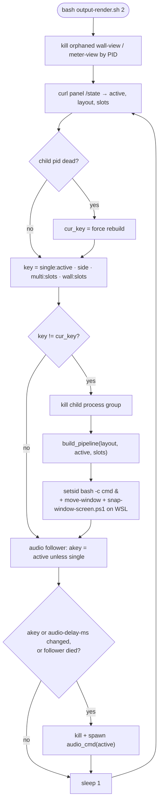

`build_pipeline` is a five-way case:

| layout | What runs | Rebuild key |
|---|---|---|
| `single` | `python3 meter-view.py <active> <screen>` | `single` — source changes rebuild only the source pipeline (no respawn); meter-view self-follows the panel |
| `program` | `python3 meter-view.py <routed> <screen>` (idle card if nothing connected) | `program:<routed>` — follows the Program Out IS-05 route, not the take |
| `side` | `python3 side-view.py <slots> <screen>` | `side` — source-selectable 2-up; a pane (slot 0/1) change rebuilds only that pane, no relaunch |
| `multi` | inline `gst-launch-1.0` compositor, four `tile_full()` fragments | `multi:<slots>` — slot changes rebuild, takes do not |
| `wall` | `python3 wall-view.py <slots> <screen>` | `wall:<slots>` — same |

`tile_full(src, idx, w, h)` is the one function to read if you want to know how a source key
becomes a decodable tile: a `case` over every key that emits the udpsrc → depay/demux → decode →
scale → `textoverlay` label → `queue leaky=downstream` → `mix.sink_<idx>` fragment, plus the audio
pad drain that TS sources need so an unlinked pad does not error the pipeline. The parser that
extracts `active`/`layout`/`slots` from the JSON is `sed` with `[a-z0-9,]*`, so source keys must
stay lowercase alphanumerics.

**Audio follows the source.** In `single` the child renderer plays its own lip-synced audio. In
every other layout the video pipeline drops audio, and `audio_cmd(active)` runs a separate
gst-launch that joins the *active* source's audio (the TS audio pad through `decodebin`, the Pi's
L24 flow, or the Opus flow for `h264`) and plays it with `autoaudiosink sync=true`, optionally
behind a `queue min-threshold-time` trim from `audio-delay-ms`. Switching sources swaps the
follower without touching video.

**Why it is manual.** The renderers draw to WSLg's Wayland surface, which exists only in a local
WSL terminal session. Launching over SSH gives audio and no window. Kill it by PID
(`/tmp/output-render.pid` is not written by this script; use `pgrep -af "[o]utput-render.sh"`),
never `pkill -f`, whose pattern matches the SSH command that launched it.

**Seamless per-source switching (single / side).** Single view and side-by-side use the same
`intervideosrc`/`intervideosink` decoupling as the production switcher: a persistent display
pipeline and separate source pipeline(s), so changing a source rebuilds only that source and
the on-screen window never respawns. This works because they run 1 (single) or 2 (side)
hardware decoders -- within WSLg's virtual-GPU headroom for creating a decode session *live*.
The 4-up **wall was NOT converted**: 3-4 concurrent decoders plus the 4K GL sink oversubscribe
the WSLg vGPU, so a live rebuild of a hardware-decoded tile starves (0 fps). A shared
GstCudaContext (one context for all decoders, via the NEED/HAVE_CONTEXT bus dance) fixes wall
*startup* but not live rebuilds; the seamless wall is shelved for a future bare-metal / VM+GPU
deployment where the vGPU limit does not apply. See `side-view.py` / `meter-view.py`.

### 7.2 `wall-view.py` — the instrumented 2x2

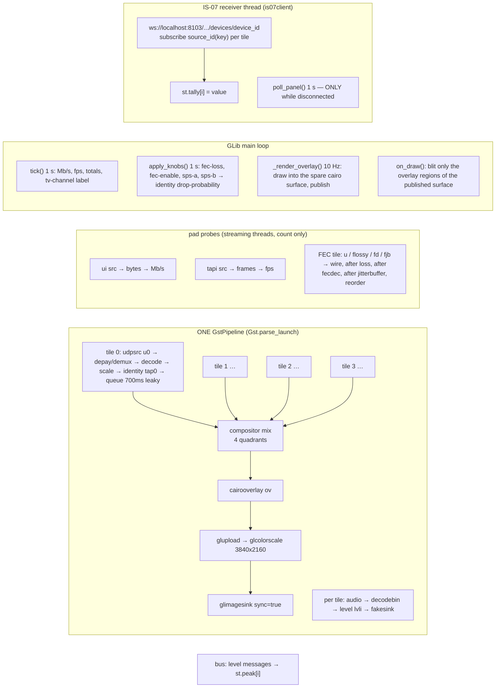

The wall exists because a gst-launch string cannot change after it starts. It keeps the
*identical* one-pipeline topology as `multi` (proven stable here), then adds everything a real
multiviewer draws live: a red tally border and "ON AIR / NMOS IS-07" flag on the taken tile, a
UMD label with Mb/s and fps (fps under 28 turns orange), per-channel audio meters from a `level`
element per tile, and for the FEC tile the counters `dropped / recovered / resid / reord`.

Four engineering choices to know about:

- **The present path is glimagesink, not waylandsink.** waylandsink presents through WSLg's SHM path (no dmabuf) — a per-frame CPU→GPU upload with uneven pacing that visibly *steps* fine scrolling content (a broadcast news ticker), even though the stream is clean (even PTS, 16.7 ms = 59.94 fps; the HDHomeRun app is smooth). glimagesink presents via OpenGL/EGL, vsync-paced — smooth, and it dropped the GPU 3D-engine load ~80% → ~60%. glimagesink cannot be resized under WSLg (it recreates its window), so the tail upscales to 3840×2160 on the GPU (`glupload ! glcolorscale`) and WSLg's 1.5× DPI makes that a 2560×1440 window filling monitor 2; the per-tile queues are 700 ms leaky (was 2-buffer) so the bursty Live TV delivery does not starve/step its tile.

- **The overlay is double-buffered and drawn off the streaming thread.** `on_draw` only blits
  regions (tally border, flag, bottom strip, ATOLL bug) from a surface the main loop finished
  10 Hz earlier. Painting a full ARGB surface per frame cost ~20 ms on its own.
- **Tally is a real IS-07 receiver.** Each tile subscribes to `source_id(key)` (UUID5 of the key,
  derived identically in the emitter). The panel is polled *only* while the WebSocket is down, and
  the flag then drops its "NMOS IS-07" line so the fallback is visible.
- **Only the FEC tile is software-decoded — diagnosed (6 Sep 2026).** Clean at zero loss on either
  decoder; the tearing is a *residual-loss* effect (what ST 2022-1 can't fully rebuild — the demo's
  point). Two mechanisms: (1) the sender carries SPS/PPS inband (`config-interval=-1`), so a lost
  SPS/PPS frame deconfigures `nvh264dec` (`Should configure decoder first`, negotiation failure) →
  torn frames — fixed by re-inserting cached SPS/PPS with `h264parse config-interval=1` on the FEC
  tile (fatal nvdec gap errors 2/14s → 0 at 5 % loss); (2) NVDEC has no macroblock error concealment,
  so residual corrupt frames still glitch, whereas `avdec_h264` conceals them — the graceful
  degradation this FEC demo exists to show. So the FEC tile uses `avdec_h264` on purpose (~25 % of a
  core for one 720p 3 Mbps tile), with `config-interval=1`; `nvh264dec`+`config-interval=1` is a
  viable GPU alternative if glitch-not-conceal is acceptable. Every
  other H.264 tile (tsrtp, 2022-7, h264) stays on `nvh264dec`. The old blunt workaround
  `WALL_SW_DECODE=true` forced *all* H.264 tiles to software (~186 % CPU) and is off in production:
  software-decoding every tile oversubscribes the WSLg display and steps the GPU-decoded Live TV tile
  to keyframes. It stays as a diagnostic for isolating decode artifacts. (Same reason the default
  4-up is compressed tiles only -- the CPU-decoded Pi `raw` tile oversubscribes the wall too; see
  STARTUP.)

### 7.3a `switcher-view.py` — production switcher (PROGRAM / PREVIEW)

A vision-mixer layout for monitor 2, decoupled so cueing a preview never touches what is on air —
the way a real switcher must behave. It is two parts bridged by `intervideosrc`/`intervideosink`:

- a **persistent display pipeline** that owns the compositor, the cairo PROGRAM/PREVIEW overlay and
  the `glimagesink` window and **never restarts**. It pulls the two buses over `intervideosrc`
  (channels `busA`/`busB`), tees each to a **fullscreen** and an **inset** compositor pad, so PROGRAM
  (fullscreen, red border) and PREVIEW (inset, green border) are just which pads are shown. A **TAKE**
  is a pure alpha/zorder animation: **CUT** is instant, **DISSOLVE** fades the incoming fullscreen up
  over `rate` seconds. Seamless — the picture never drops.
- two **independent source pipelines** (`decode -> intervideosink channel=busA/busB`). Changing a
  source restarts **only that source pipeline**; the display and the on-air PROGRAM keep running, and
  `intervideosrc` shows black for that one bus until the new source arrives.

Driven by `~/atoll-run/switcher` = `"<srcA> <srcB> <transition> <rate> <take_seq>"`; the take-seq
**parity** picks PGM (even=A, odd=B), so a TAKE just bumps the seq (animate) while the two source
identities stay put. **PROGRAM audio transitions with the picture**: each bus decodes audio to a
second inter-pipeline bus (`interaudiosink` abusA/abusB) and a persistent audio mixer runs both
through `volume` elements (volA/volB) into an `audiomixer`; the take animates them, so a DISSOLVE
crossfades the sound over the same `rate` as the video and a CUT switches it instantly (in-process,
no audio subprocess). The panel's SWITCHER row picks the PREVIEW source, toggles Cut/Dissolve and fires
TAKE (`/switcher/{state,pvw,take,trans}`). Sources: Live TV, Home videos, Music, TS-over-RTP, H.264.

### 7.3 `meter-view.py` — single view

Same construction as the wall for one source: `build()` returns a pipeline string per source key
ending in `videoconvert → cairooverlay ov → ATOLL bug → sink sync=true` (Live TV/`hevc` upscales on the GPU — `glupload → glcolorscale 3840×2160 → glimagesink` — for a smooth, full-screen monitor-2 window; other sources use `waylandsink`), with the audio branch
`decodebin → level → downmix to stereo → queue aq → autoaudiosink sync=true`. Level measures
all channels before the downmix, so Live TV shows six bars (L R C LFE Ls Rs) while WSLg's stereo
Pulse still gets something it accepts. Probes on `usrc` (bitrate), `vpre` (source caps) and
`lvl` (sample rate) feed the top-left info panel. For `fec` and `sps` it carries the same knob
polling and counters as the wall, plus per-path packet rates for 2022-7 with a "DEAD" marker.

### 7.4 The browser paths

`multiview-web.py` (`:8099`) forks `multiview-mjpeg.sh` per HTTP client, which is the `multi`
compositor with `jpegenc → multipartmux → fdsink` in place of the window, streamed as
`multipart/x-mixed-replace`. `jxs-web.py` (`:8100`) does the same for a local
`svtjpegxsenc → svtjpegxsdec` loop. Neither follows the panel's slot assignment live in the way
`output-render` does; they were built as a remote view when WSLg could not open a window and are
kept as the iPad/Mac way to *see* the wall.

---

## 8. The NMOS plane

```mermaid
flowchart TB
  subgraph docker["docker compose — deploy/nmos"]
    reg["nmos-registry (nmos-cpp)<br/>Registration + Query API :8080<br/>+ IS-09 System API /x-nmos/system<br/>expiry 12 s"]
    vnode["nmos-virtnode (nmos-cpp example node)<br/>Node + Connection API :8090<br/>receivers v0 v1 m0 m1 … · own IS-07 sources · events ws :8091"]
    test["amwa/nmos-testing :5000"]
    vnode -- "registers + heartbeats" --> reg
  end

  panel["monitor-web.py"] -- "IS-05 PATCH staged<br/>master_enable on v0 / m0" --> vnode
  panel -- "IS-04 Query (inspector)" --> reg
  panel -- "IS-05 /active /staged /constraints, SDP (inspector)" --> vnode

  is07["is07-tally.py<br/>node atoll-is07-tally · device · 13 sources · 13 flows · 13 senders<br/>transport urn:x-nmos:transport:websocket"] -- "POST /resource · POST /health/nodes/id 5 s · re-register on 404" --> reg
  is07 -- "REST :8102 /x-nmos/events/v1.0/sources/id/state" --> anyctl["any IS-07 controller"]
  is07 -- "ws :8103 /x-nmos/events/v1.0/devices/device_id" --> wall["wall-view.py"]
  is07 -- ws --> an["analyser.py"]

  reels["reels-nmos.py (launch-media only)<br/>source → flow → sender for Test Reels<br/>templated on sender/m1, re-POST 5 s<br/>SDP served :8097"] --> reg

  legacy["activation-watcher.py + take.py (legacy demo)<br/>poll receiver a0 /active → start/stop L24 audio"] -. "IS-05" .-> vnode

  progout["program-out.py<br/>node atoll-program-out · device · receiver 'Program Out'<br/>IS-05 Connection API :8092"] -- "POST /resource · health 5 s" --> reg
  musicnmos["music-nmos.py<br/>node atoll-music · device · 2 senders (video + L24 audio)<br/>SDP per sender :8093"] -- "POST /resource · health 5 s" --> reg
  pinmos["pi-nmos.py<br/>node atoll-pi · device · 2 senders (ST 2110-20 raw + -30 L24)<br/>standards SDPs :8095"] -- "POST /resource · health 5 s" --> reg
  audiomap["audiomap-nmos.py<br/>node atoll-audiomap · device · cm-ctrl control<br/>IS-08 Channel Mapping API :8094"] -- "POST /resource · health 5 s" --> reg
  panel -- "IS-08 map/activations (route audio channels)" --> audiomap
  audiomap -- "writes ~/atoll-run/audiomap · restarts" --> amapper["audiomapper.sh<br/>localhost L24 → audiomixmatrix → MUSIC_AUDIO_GRP"]
  is07 -. "IS-09: discover System API via DNS-SD (_nmos-system._tcp)<br/>heartbeat from global · also program-out + music-nmos" .-> reg
  panel -- "IS-05 PATCH staged (route any island flow)" --> progout
  progout -- "writes ~/atoll-run/programout" --> ro["output-render.sh<br/>program layout"]
```

Seven things Atoll adds to the stock nmos-cpp stack:

1. **A control surface that issues real IS-05.** The panel's switch between the Pi raw flow and
   the Home videos flow is an actual `master_enable` toggle on the node's receivers `v0` and `m0`.
   The renderer does not read that state; it pulls the multicast directly and follows the panel.
   That makes IS-05 a *gate* in this rig, not a transport reconfiguration, which is why no
   `transport_params` are sent.
2. **An IS-07 emitter with a transport.** `is07-tally.py` publishes per-source booleans in the
   exact message shape the nmos-cpp node uses (`identity.source_id`, `event_type`,
   `message_type`, `timing.creation_timestamp` in TAI = UTC + 37, `payload.value`). Timestamps
   mark the *transition*, not the poll. The WebSocket is hand-rolled RFC 6455 (no library is
   installable, PEP 668): a client sends `{"command":"subscription","sources":[…]}`, gets the
   echo plus the current state of each source immediately, then `state` on every change and
   `health` every 5 s. With a served transport the 13 senders are honestly advertised in IS-04.
3. **A discoverable custom sender.** `reels-nmos.py` shows the pattern for registering your own
   source/flow/sender against the registry directly: copy the schema from an existing node
   resource, attach to the virtnode's node/device, re-POST under the expiry, serve an SDP.
   `music-nmos.py` uses the same pattern to publish the music channel as its own node with two
   senders (video + ST 2110-30 L24 audio) and an SDP each — the A2 approach: a standalone
   registrar, not an extension of the virtnode. The L24 SDP is standards-clean 2110-30; the
   video is HEVC-in-MPEG-TS/UDP advertised for discovery + Program-Out routing (which matches
   by multicast ip:port, not the SDP, since NMOS has no raw-TS/UDP transport URN).
4. **A routable software receiver — full IS-05.** `program-out.py` registers its own
   node/device/receiver and serves the IS-05 v1.1 Connection API on `:8092`. Activating its
   receiver writes `~/atoll-run/programout`, which the renderer's `program` layout follows — a real
   connection that drives the picture, discoverable so an external NMOS controller can route it too.
   A controller can connect it three ways: **transport_params** (a multicast_ip + destination_port
   directly); **sender_id** (name a discovered NMOS sender — program-out looks it up in the registry
   Query API, fetches its SDP via `manifest_href`, parses the multicast/port, and routes to it: the
   canonical "connect this receiver to that sender", verified against the music sender →
   `239.10.10.30:5012`); and any of the three **activation modes** — `activate_immediate`,
   `activate_scheduled_relative` ("in N seconds") and `activate_scheduled_absolute` (at a TAI time),
   the scheduled ones armed by a timer that fires the staged→active move on the clock (a new PATCH
   supersedes a pending activation). On activate/deactivate it updates the receiver's IS-04
   `subscription` (`sender_id`, `active`) and re-registers, so the registry and any controller see the
   connection — the genuinely **two-way** half of IS-05, versus the one-way *gate* in point 1. The
   panel exposes this with per-flow route buttons, a "Schedule +5s" toggle (routes then fire on the
   clock, with a pending badge) and a guided-demo step.
5. **An IS-09 System API client.** Every Atoll node now honours the System API. `atoll_system.py`
   (shared by `is07-tally.py`, `program-out.py` and `music-nmos.py`) discovers it via DNS-SD
   (`_nmos-system._tcp`, using `avahi-browse`; lowest advertised `pri` wins), falls back to the
   configured registry host — the nmos-cpp registry co-hosts the System API on `:8080` — if
   DNS-SD finds nothing, fetches `/x-nmos/system/v1.0/global`, and drives each node's IS-04
   registration **heartbeat interval** from `is04.heartbeat_interval` there instead of a
   hard-coded 5 s. A daemon thread re-discovers and re-fetches, tracking the global `version`, so
   a live change is picked up without a restart; it also reads the `ptp` block (domain_number,
   announce_receipt_timeout) for reference. This closes the IS-09 node-behaviour gap — the nodes
   previously ignored the System API. Needs `avahi-utils` (for `avahi-browse`) on the host.

   **Verified with AMWA `nmos-testing`.** IS-09-01 (System API server) passes — 5/5 applicable,
   0 fail. IS-09-02 (node System-API discovery, multicast) passes the runnable tests against the
   virtnode: test_01 (discover via multicast DNS), test_03 (correct versioned path) and test_04
   (selects by advertised priority); test_02/02_01 (unicast DNS) stay disabled unless
   `DNS_SD_MODE=unicast`, and test_05 is the manual check that the config takes effect — which our
   client does by applying `is04.heartbeat_interval`. IS-09-02's discovery tests advertise a *mock*
   System API and wait for the node to contact it, so the node under test is **restarted during the
   advertisement window** (widen `DNS_SD_ADVERT_TIMEOUT` in nmos-testing's UserConfig to make the
   timing comfortable) to trigger a fresh DNS-SD discovery.

6. **Audio channel mapping (IS-08).** `audiomap-nmos.py` (`:8094`) serves the AMWA IS-08 v1.0
   Channel Mapping API for the music audio and registers a node/device with a `cm-ctrl` control so
   it is discoverable. It exposes one input (the music stereo) and one output (the ST 2110-30 L24
   sender), and a controller maps the output's channels to the input's — straight stereo, swap
   L↔R, dual-mono, or muting a channel (IS-08 is channel *routing*, one input channel per output
   channel or silence — not mixing). Activations are immediate or scheduled (relative/absolute) via
   `POST /map/activations`. The map is made **audible** by an IS-08 processor in the audio path:
   `music-channel.sh` sends its decoded L24 to `localhost` instead of the multicast group, and
   `audiomapper.sh` (a tiny `udpsrc → rtpL24depay → audiomixmatrix → rtpL24pay → udpsink` hop)
   applies the routing matrix — translated from the active map — and re-sends on the real
   `MUSIC_AUDIO_GRP` the renderer plays. Only that hop restarts on a map change, so re-routing is
   instant and never disturbs the music video tile (which would stall the multiview compositor). The
   panel drives it with Stereo / Swap L↔R / Mono (L) / Mute R buttons and a guided-demo step.

7. **Standards-complete SDPs for the real ST 2110 senders (IS-04 manifests + ST 2110-21).**
   `pi-nmos.py` (`:8095`) advertises the Pi's genuine ST 2110 essences — ST 2110-20 raw video
   (RFC 4175) and ST 2110-30 L24 audio — which were previously on the wire but invisible to NMOS.
   It registers a node/device with two senders and serves a standards-complete SDP for each. The
   video SDP carries the full **ST 2110-20** media format (`sampling=YCbCr-4:2:2`, `width`/`height`,
   `exactframerate`, `depth`, `TCS`, `colorimetry`, `PM=2110GPM`, `SSN=ST2110-20:2017`) and the
   **ST 2110-21** sender-pacing declaration (`TP=2110TPW`). Both SDPs carry `a=mediaclk:direct=0`
   and `a=ts-refclk:ptp=IEEE1588-2008:<gmid>:0` — the real PTP grandmaster EUI-64 and domain, tying
   the essence to the same clock the follower demo locks to. **Honesty on -21:** these are software
   gst senders with no hardware packet shaping, so they are declared **Wide** (`2110TPW`), not
   Narrow — true `2110TPN` needs a hardware-paced NIC; the SDP states what the sender actually is.
   `music-nmos.py`'s L24 SDP was likewise upgraded from a `traceable` reference clock to the specific
   grandmaster id. The senders and their SDPs show up in the panel's IS-04/05 inspector.

`is07client.py` is the shared receiver (`Is07Client(sources, port, on_state, on_status)`,
`source_id(key)`, `device_id()`): reconnects with capped backoff, treats 20 s of silence as a
dead link, fires callbacks on its own thread.

8. **IS-10 authorization (BCP-003-02).** `auth-server.py` (`:8106`) is the OAuth 2.0 / JWT
   authorization server and `program-out.py` enforces its tokens (see §5.6). The AMWA
   `nmos-testing` **IS-10-01** suite is disabled in the current build (`IS1001Test` is unregistered
   and its `__init__` no longer matches the harness -- the maintainers pulled it "until testing can
   be refactored to deal with commercial servers"), so an official automated pass is not currently
   possible with the tool. Instead `pc/is10-conformance.py` checks the server against the specs it
   implements -- RFC 8414 metadata, the JWKS, an RS256 JWT whose signature verifies against the JWKS
   and whose claims carry the BCP-003-02 `x-nmos-<api>` access rights, `client_credentials` issuance,
   RFC 7591 registration, and rejection of unsupported grants: **31/31 checks pass**.

---

## 9. The analyser

`analyser.py` opens one raw UDP socket per flow in `FLOWS` (built from `atoll.conf`, 18 rows
counting the two FEC parity flows), joins the group with a 16 MB receive buffer, and a single
`select` loop counts packets and bytes. If the first byte says RTP v2 it also tracks payload
type, SSRC and sequence gaps (a forward gap under 1000 is loss, anything else is reorder). A
sampler thread turns the counters into pps / Mbit/s / average datagram / loss % every second.
`/flows` returns the JSON the page polls; the page marks average datagrams under 400 B, colours
loss, shows the IS-07 tally per row via an explicit `IS07_KEY` map (two 2022-7 rows share `sps`,
three FEC rows share `fec`, Pi audio/ANC/Opus show a dash), and lists the IS-07 event stream with
TAI timestamps. A **PGM** column (and a `PGM → <flow>` header readout) flags whichever flow is
currently routed to Program Out over IS-05 — polled from `program-out.py` and matched by multicast
address, so it is exact. The header also shows the panel’s current **Take** and an **FEC** summary with a live
recovery counter. The analyser runs one small GStreamer ST 2022-1 decoder (its only use of gst) that
joins the media + parity flows, injects the SAME `fec-loss`/`fec-enable` knobs the renderers use, and
counts packets at the wire, after the loss injector, and after recovery — so it reports matrix, parity
overhead, packets **recovered / dropped**, and lifetime residual, and it tracks the demo. (A wire-only
count would read zero: the demo’s loss is injected receiver-side, not on the wire.) An **output**
column shows where each flow currently sits on monitor 2 — wall/multi quadrant (TL/TR/BL/BR),
side L/R, single, or program — from the panel layout + slots. It is deliberately not GStreamer so it cannot disturb what it measures, and
its own buffers are sized so it does not report its own overflow as network loss.

A **ST 2110-21 sender-pacing** section measures how each flow's packets actually arrive, using
`SO_TIMESTAMPNS` **kernel RX timestamps** (via `recvmsg`) rather than when Python drained the socket —
so it reflects real arrival pacing, not the analyser's own scheduling. Per flow it drains a virtual
receive buffer at the flow's mean rate and reports the peak occupancy as **Cmax** (the ST 2110-21
network-compatibility model, in packets), plus the max back-to-back **burst** and mean/max inter-packet
gap, and a receiver-observed class — **narrow** (≤5), **wide** (≤20), **bursty** (>20). The genuine
ST 2110 essences show their declared SDP `TP`. The measured numbers back the honest SDPs: the Pi raw
video bursts a whole frame of packets then idles (Cmax ≈ 230, *bursty*), while the Pi L24 audio at a
fixed 1 ms ptime paces tight (gap ≈ 1000 µs, Cmax ≈ 11), and low-rate Ancillary/Opus read *narrow* —
which is exactly why the ST 2110 senders declare `TP=2110TPW`, not Narrow (true `2110TPN` needs a
hardware-paced NIC).

---

## 10. Launch paths, then and now

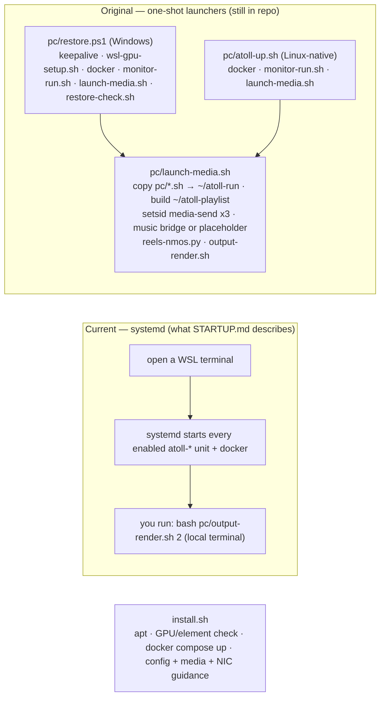

The systemd units in `deploy/systemd/` are the live path: every sender and control process is a
unit with `Restart=on-failure`, running as the WSL user from the repo's `pc/` directory. The
one-shot launchers predate that and are kept for a Linux-native box and for the pieces systemd
does not cover (`~/atoll-playlist`, the Test Reels sender, `reels-nmos.py`). Some of them carry
paths from the previous PC build (`monitor-run.sh` hardcodes `/mnt/c/Users/dgper/...`,
`restore-check.sh` still probes `:8095`), so treat them as reference rather than run them blind.

`move-window-screen.ps1` and `snap-window-screen.ps1` are the WSL-only placement helpers `output-render.sh` runs after each renderer maps (Wayland clients cannot position themselves). `move-window-screen.ps1` catches the newly-mapped window and snaps it to the chosen monitor's bounds for `TimeoutSec` — for `waylandsink` windows, which tolerate the resize; it now **skips** `OpenGL Renderer` (glimagesink) windows. `snap-window-screen.ps1` places the glimagesink window (matched by its `OpenGL Renderer (Ubuntu)` title) **move-only** — never resizing, because glimagesink recreates its window on any resize — so it relies on the renderer opening at the right size (the 3840×2160 → 2560×1440 upscale above). Both run via a resolved full PowerShell path (`PWSH`) so placement works even when `output-render.sh` is started from an environment whose PATH lacks the Windows interop dirs.

---

## 11. Legacy, experimental and diagnostic code

Kept in `pc/` because each proved something or is the fallback for something.

| File | Status | What it is |
|---|---|---|
| `tv-send.sh` | fallback | Original Live TV bridge: kills and restarts gst on a channel change (stereo MP3). |
| `tv-send-seamless.py` | fallback | Second attempt: continuous encoder fed by intervideosrc/interaudiosrc. Worked, but the split A/V bridges drifted ~0.7 s and its timeout emitted green. Lesson: `intervideosink` on a live source must be `sync=false`. |
| `multiview-app.py` | experimental | Per-tile GstPipelines feeding one compositor over intervideo channels so a tile error restarts only that tile. Isolation proven; startup races and preroll stalls kept it from replacing `output-render.sh`. Made redundant when the *sender* became seamless. |
| `music-send.sh`, `music-placeholder.sh` | superseded | The two halves `music-channel.sh` now wraps. |
| `hevc-stream-*.sh`, `hevc-stream-env.sh` | demo | The original 4K HEVC NVENC→NVDEC RTP pipeline that proved GPU encode/decode under WSL. |
| `jxs-*.sh`, `jxs-install-libs.sh`, `svt-ffmpeg-build.sh` | demo | The JPEG XS history: SVT-JPEG-XS via custom FFmpeg over MPEG-TS at 1080p59.94 (~381 Mb/s), retired because GStreamer had no decoder then and no RFC 9134 payloader exists. |
| `video-web.py` | legacy | First viewer: 2110-20 raw → MJPEG/PNG to a browser at `:8095`, with a codec A/B and PTP timecode. Hardcodes the old Pi group `239.10.10.20:5005`. |
| `activation-watcher.py`, `take.py` | legacy demo | The first IS-05 → media bridge: watch receiver `a0`'s `master_enable`, start/stop an L24 audio receiver. |
| `reels-nmos.py`, `nmos-inspect.py` | utility | Register the Test Reels sender; dump the registry. |
| `fecverify.py` | diagnostic | Tees one udpsrc into a reference branch and a loss→fecdec branch and compares dropped packets byte-for-byte. Proved recovery is 100 % byte-correct and that the visible damage was *ordering*, not content. |
| `jitter-meter.py` | diagnostic | RTP inter-arrival jitter on the Pi audio flow with kernel receive timestamps. |
| `grab-screen.ps1` | diagnostic | Windows-side screen grab. Cannot see the WSLg surface; documented so nobody trusts it again. |
| `build-reels-loop.ps1` | utility | Concatenates the vertical phone clips into one 720p loop for the Test Reels channel. |
| `open-*-firewall.ps1`, `wsl-gpu-setup.sh` | setup | Windows firewall holes for the iPad; force Mesa's d3d12 driver under WSLg. |

---

## 12. Cross-cutting rules the code relies on

These are the constraints that recur across modules. Each one was learned by breaking it.

- **One sender per multicast group.** Two senders on a group produce a corrupt stream and doubled
  pps. Never start a sender ad hoc over SSH with `setsid … &`; use the unit, and count real
  senders with `pgrep -fc "[u]dpsink host=<grp> port=<port>"`.
- **High-rate multicast receive needs a large socket buffer.** L24 audio at 1 ms ptime is ~1000
  pkt/s; a `udpsrc buffer-size=16 MB` request is *denied* unless `net.core.rmem_max` is raised
  (WSL default is 4 MB), and the socket then overflows and drops packets before the jitterbuffer
  sees them — heavy audio dropouts. `deploy/sysctl/60-atoll-rmem.conf` sets it to 32 MB (persisted
  to `/etc/sysctl.d`). Fixes both the Music and Pi `raw` L24 feeds.
- **The WSLg audio sink resyncs on a slaved clock.** The pulse sink plays on the Windows audio-device clock, not the pipeline clock; a `sync=true` audio sink slaves to it with the default *skew* method and hard-corrects roughly every 5 s — an audible click. The Music monitor runs its L24 sink **`sync=false`** (free-run on the device clock): music is a visualizer feed, so there is no lip-sync to lose. Applied in `meter-view.py` (single/program) and the `output-render.sh` audio follower (wall/multi/side); other sources keep `sync=true`.
- **`mpegtsmux alignment=7` on every TS sender.** Packet rate is the ceiling; 188-byte datagrams
  burn it for nothing.
- **`config-interval=-1`** on `h264parse`/`h265parse` and on `rtph264pay`, so joiners get headers.
- **Every TS tile in a compositor must drain its audio pad**, and on the RTP path that drain needs
  a `queue` before `fakesink` or the demuxer stalls. The music tile is video-only because the
  placeholder card has no audio pad to drain.
- **A compositor stalls if any input never gets caps.** Every tile's group must be fed before the
  multi/wall layouts start; that is why the placeholder card exists.
- **Keep A/V together through one encoder** when re-timing them; do not split across
  intervideo/interaudio bridges (independent latency = skew) and do not delay video into an
  `intervideosink` (starves it → green).
- **Restamp before the encoder, not after.** `mpegtsmux` re-derives DTS.
- **`rtpst2022-1-fecdec` output needs a jitterbuffer after it** with a wide misorder window
  (`latency=500 max-misorder-time=5000 max-dropout-time=5000`): recovered packets carry their
  original, already-past timestamps and no buffer PTS.
- **Source keys are lowercase alphanumerics.** The renderer's `sed` parser and the IS-07 UUID5
  derivation both assume it; the analyser maps labels to keys explicitly rather than by name.
- **Python reads config through `NEED` lists.** Add the key there before using it.
- **The panel's JavaScript lives in a Python string.** No `\'` inside it.
- **Instrument the running pipeline, not a standalone harness**, when a symptom is visible on the
  wall. Three harnesses in a row measured the wrong property; the wall showed ~4000 reorders
  where each harness showed zero.
- **Tear a dynamic branch down downstream → upstream** (`teardown_source` in the TV sender). An
  element going to NULL flushes the pushes blocked *into* it, which frees the element above to stop
  its task. Source-first waited forever on `souphttpsrc`'s task, blocked into a full queue below it,
  and that wait ran on the main loop, so the watchdog that should have caught it was frozen too
  (Live TV black, deaf to channel changes, 3 Sep 2026). The thread-based hang guard is the backstop.

---

## 13. Timing & clocks

Two independent clocks show up as timecodes, and keeping them aligned matters.

- **The panel timecode follows the Pi grandmaster.** The panel proxies the Pi's `:8000/time`, so its
  clock is the island's PTP grandmaster time (NTP-correct real time).
- **The output's burned-in `clockoverlay` uses the PC (WSL) system clock.** So if the PC clock drifts,
  the output timecode drifts with it — independently of the panel.

**The drift trap (seen 7 Sep 2026, output ran ~9 s ahead of the panel).** The WSL2 guest clock is not
its own — the WSL kernel force-syncs it to the **Windows host** via a Hyper-V PTP clock
(`/dev/ptp_hyperv`, with `chronyd` alongside). If the Windows **W32Time** service is stopped, the host
drifts (it was ~+10 s), the WSL guest follows, and every PC-stamped timecode leads the panel by that.
Fix on the **Windows host** (elevated): start + auto-enable `W32Time` and point it at NTP
(`Set-Service W32Time -StartupType Automatic; Start-Service W32Time; w32tm /config /manualpeerlist:… ;
w32tm /resync /force`). The guest then tracks the corrected host to ~10–30 ms of the grandmaster —
imperceptible on a timecode, and persistent.

**Why the PC is not PTP-disciplined.** It would be the broadcast-pure choice, but it is **not
achievable on WSL**: the WSL kernel owns the guest clock and overrides `ptp4l` (and `chronyd`) — proven
by locking `ptp4l` to the grandmaster (it reaches SLAVE) yet its adjustments never stick, and by
stopping `chronyd` (the clock stays pinned to the host). If real PTP on the PC is ever needed, in
increasing accuracy: **(1)** a real VM instead of WSL — you can disable the hypervisor's host time-sync
so `ptp4l` becomes authoritative, but a virtual NIC is **software-timestamped** (~sub-ms to a few ms,
no PHC); **(2)** **bare-metal Linux + a NIC with a PHC** (PTP Hardware Clock — hardware timestamping at
the wire, `/dev/ptp0`, `ethtool -T`) → sub-microsecond, broadcast-grade; **(3)** or pass a PTP NIC
through to a VM (Hyper-V DDA / SR-IOV) for PHC-grade timing in a guest. The whole island is
software-timestamped today anyway (even the grandmaster runs `ptp4l -S`), so it lives in the ~ms
regime — PHC-grade only matters for true genlock interop of the PC's own ST 2110 timestamps.
